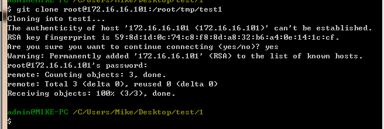

git的简单使用
===================================================

安装git
--------------------------------------

Linux下安装
`````````````````````````````````````````````````
CentOS为例：
::

    yum install git

Windwos下安装
`````````````````````````````````````````````````
下载地址： https://git-scm.com/downloads
    

配置git
--------------------------------------
这里以配置全局为例：

配置user信息
`````````````````````````````````````````````````
::

    git config --global user.name "Mike"
    git config --global user.email "Mike_Zhang@live.com"

配置http代理
`````````````````````````````````````````````````
::

    git config --global http.proxy 'socks5://127.0.0.1:1080'
    git config --global https.proxy 'socks5://127.0.0.1:1080'

取消配置命令：
::

    git config --global --unset http.proxy
    git config --global --unset https.proxy    
    
使用git
--------------------------------------
    
初始化
`````````````````````````````````````````````````
::

    git init

添加本地所有文件
`````````````````````````````````````````````````
::

    git add *

递交
`````````````````````````````````````````````````
::

    git commit -m "git test init"

查看日志
`````````````````````````````````````````````````
::

    git log

检验仓库
`````````````````````````````````````````````````
::

    git clone user@host:path
    
例如：
::

    git clone root@172.16.16.101:/root/tmp/test1
    


添加分支
`````````````````````````````````````````````````
语法：
::
    
    git checkout -b 分支名字
    
例如：
::

    git checkout -b branch1
    
添加branch1分支

分支递交
`````````````````````````````````````````````````
::

    git checkout 分支名称
    git commit -m "注释"
    
例如：
::

    git checkout branch1
    git commit -m "branch1 init"

返回主分支
`````````````````````````````````````````````````
::

    git checkout master

合并子分支到主分支
`````````````````````````````````````````````````

语法如下：
::

    git merge 子分支名称
    
比如：
::

    git merge branch1

删除子分支 
`````````````````````````````````````````````````
::

    git branch -d  子分支名称
    git branch -d branch1


拉数据
`````````````````````````````````````````````````
::

    git pull

推数据
`````````````````````````````````````````````````
::

    git push
    
在使用git push 代码到数据仓库时，提示如下错误:
::

    [remote rejected] master -> master (branch is currently checked out)

这是由于git默认拒绝了push操作，需要在服务端进行设置，修改.git/config文件后面添加如下代码：
::

    [receive]
    　　　　denyCurrentBranch = ignore     

放弃单个文件的修改
`````````````````````````````````````````````````
::

    git checkout – 文件名
    
例如：
::

    git checkout – test1.txt

放弃本地所有递交和改动，并将本地主分支指向它
`````````````````````````````````````````````````
::

    git fetch origin
    git reset --hard origin/master


让 git 输出彩色
`````````````````````````````````````````````````
::

    git config --global color.status auto 
    git config --global color.diff auto 
    git config --global color.branch auto 
    git config --global color.interactive auto    
        