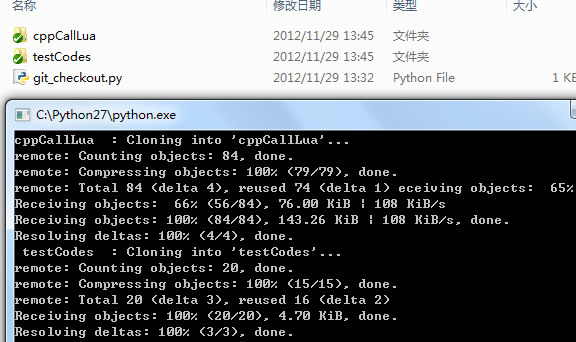
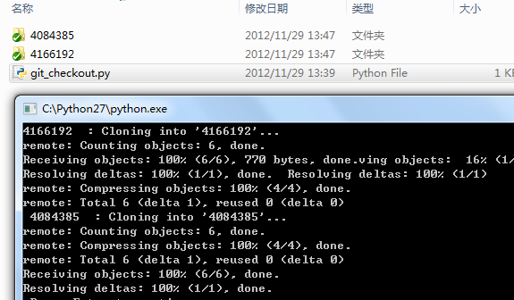

#git批量备份

我用git的目的主要是为了数据的完整性，信息不丢失，虽然项目的代码服务器和本地都会存一份，但有时候自己的小片段代码很多（比如github的gist），不可能每天都用得到，需要定期的备份，以备不时之需（比如网络断开、服务器当机等因素）。

###一、备份原理
通过某种方法获取需要备份repository的名称（比如静态配置等），如果在指定目录里面该repository存在（即文件夹存在），
进入文件夹，执行git pull操作；
如果不存在，执行git clone操作。

###二、自建git服务器备份
git服务器ip：192.168.1.100  
git账户：git  
Repositories：/home/git/test1.git,/home/git/test2.git  
正常访问：  

	git clone git@192.168.1.100:test1.git  
	git clone git@192.168.1.100:test2.git  

1、配置config文件  
config配置如下：  

	Host host100 
	        Hostname 192.168.1.100
	        User git
	        IdentityFile C:/Users/admin/.ssh/id_rsa_gitBackup

这个不懂的可以参考这里:
[http://www.cnblogs.com/MikeZhang/archive/2012/11/27/gitWithSshKey_20121127.html](http://www.cnblogs.com/MikeZhang/archive/2012/11/27/gitWithSshKey_20121127.html)

2、批量获取  
python代码：

	import os
	hostName = "host100"
	dirs = [
		'test1',
		'test2'
	]
	
	for dirName in dirs:
		print dirName," : ",
		if os.path.exists(dirName): #如果存在执行pull操作
			strCmd = "cd %s && git pull && cd .." % dirName
			os.system(strCmd)
		else: #不存在则执行clone操作
			strCmd = "git clone %s:%s.git " % (hostName,dirName)
			os.system(strCmd)

###三、github备份
1、配置config文件   

	Host github
	        Hostname github.com
	        User git
	        IdentityFile C:/Users/admin/.ssh/id_rsa_github
	
	Host gist
	        Hostname gist.github.com
	        User git
	        IdentityFile C:/Users/admin/.ssh/id_rsa_github_gist
	
2、备份Repositories（以我的github为例）  
(1)命令行访问方式：  

	git clone github:mike-zhang/cppCallLua.git

(2)python脚本批量操作：

	#for github 
	import os
	
	hostName = "github"
	userName = "mike-zhang"
	repoNames = [
		'cppCallLua',
		'testCodes'
	]
	
	for repo in repoNames:
		print repo," : ",
		if os.path.exists(repo):		
			strCmd = "cd %s && git pull && cd .." % repo
			os.system(strCmd)
		else:		
			strCmd = "git clone %s:%s/%s.git " % (hostName,userName,repo)
			os.system(strCmd)

(3）运行效果
  

3、备份gist（以我的gist为例）  
(1)命令行操作  
git clone git@gist.github.com:4166192.git gist-4166192  
(2）python脚本批量操作  
这里以两个gist例子：  

	#for gist 
	import os
	
	hostName = "gist"
	userName = "mikezhang9986"
	repoNames = [
		'4166192',
		'4084385'
	]
	
	for gist in repoNames:
		print gist," : ",
		if os.path.exists(gist):		
			strCmd = "cd %s && git pull && cd .." % gist
			os.system(strCmd)
		else:		
			strCmd = "git clone %s:%s.git " % (hostName,gist)
			os.system(strCmd)
	
(3)运行效果

我这里考虑的比较简单，更强大的功能还需读者自行扩展。  
源码地址(gist)：[https://gist.github.com/4166192](https://gist.github.com/4166192)

