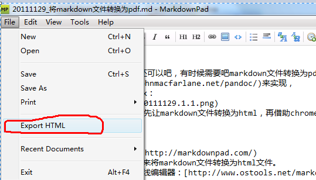
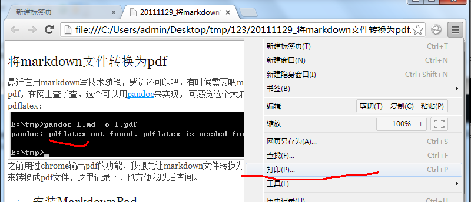
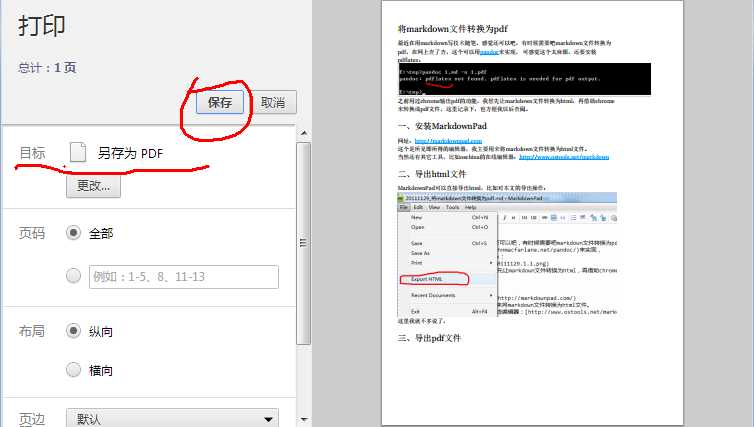

##将markdown文件转换为pdf

最近在用markdown写技术随笔，感觉还很好，可有时候需要吧markdown文件转换为pdf，在网上查了查，这个可以用[pandoc](http://johnmacfarlane.net/pandoc/)来实现，
可感觉太麻烦，还要安装pdflatex：

由于之前用过chrome将网页输出为pdf文件的功能，我想先让markdown文件转换为html，再借助chrome来转换成pdf文件，这里记录下，也方便我以后查阅。

###一、安装MarkdownPad
网址：[http://markdownpad.com](http://markdownpad.com/)  
这个是所见即所得的编辑器，我主要用来将markdown文件转换为html文件。  
当然还有其它工具，比如oschina的在线编辑器：[http://www.ostools.net/markdown](http://www.ostools.net/markdown)  

###二、导出html文件
MarkdownPad可以直接导出html，比如对本文的导出操作：  
   
这里我就不多说了，直接存盘就行了。

###三、导出pdf文件  
1、用chrome打开html文件，选择“打印”选项  
事实上，当你成功导出为html文件时，chrome浏览器会自动打开（我的是这样的，感觉这个依赖默认浏览器的设置），选择“打印”选项：  
   
2、输出pdf文件  
这里只介绍简单的输出，用默认格式进行。  
在打印页面中将“目标”更改为“另存为pdf”，点击“保存”：  
   
在弹出的对话框中选择路径，进行保存即可。   

