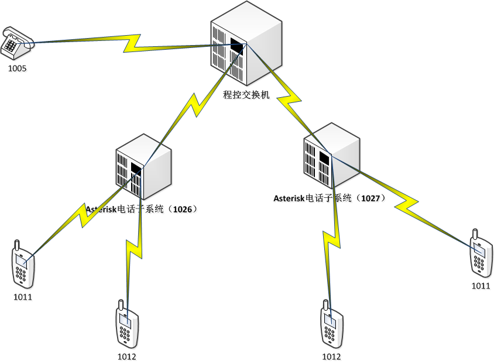

# asterisk自动拨打分机号码

## 背景
系统结构图   

现存电话系统中用1026和1027分机，在1026和1027下面各有一个asterisk实现的电话系统。
A : 1027系统下的1011分机
B : 1026系统下的1012分机
现在通过A呼叫B，由于1026系统中实现了语言菜单，首先可以通过91026呼入1026系统（外线加拨9），然后根据提示音输入1012进行呼叫。
现存交换机不支持号码直接拨打（暂时没找到解决方案），即：
从A直接拨打910261012，不能完成对B的呼叫。

## 原理
  
双音多频 DTMF（Dual Tone Multi Frequency）
双音多频信号（DTMF），电话系统中电话机与交换机之间的一种用户信令，通常用于发送被叫号码。
双音多频信号是贝尔实验室发明的，其目的是为了自动完成长途呼叫。
有效字符集为：          "0123456789*#abcdABCD"
字符w可以进行等待，一个w代表0.5秒的等待时间，如果需要更长时间则需要多个w的组合来实现，比如：
123456wwww789

## 配置extensions.conf实现

	[macro-dtmf]
	exten => s,1,Wait(8)
	exten => s,n,SendDTMF(${ARG1})
	
	[DLPN_testOut2]
	exten => _9XXXXXXXX,1,Dial(DAHDI/g1/${EXTEN:1},30,M(dtmf,${EXTEN:5}))
	
	[DLPN_DialPlan1]
	;include = DLPN_testOut  ;define in extension.lua
	include = DLPN_testOut2
	
## 配置extension.lua实现（lua实现）

	extensions = {
	        DLPN_testOut = {
	                ["_9XXXXXXXX"] = function(context,extension)
	                        --app.dial("DAHDI/g1/" .."1026", "10","M(dtmf)tr")
	                        num1 = string.sub(extension,2,5)
	                        num2 = string.sub(extension,6)
	                        app.dial("DAHDI/g1/" ..num1, "30","D(wwwwwwwwwwwwwww"..num2..")")
	                end;
	        };
	}
