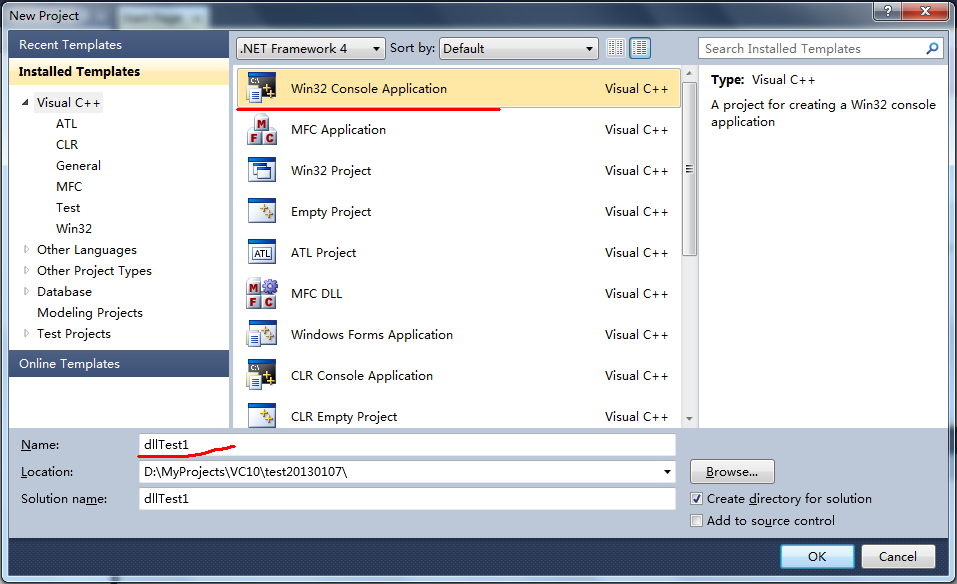
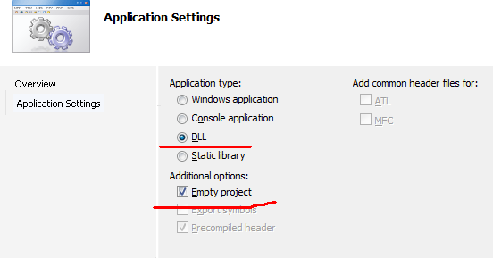
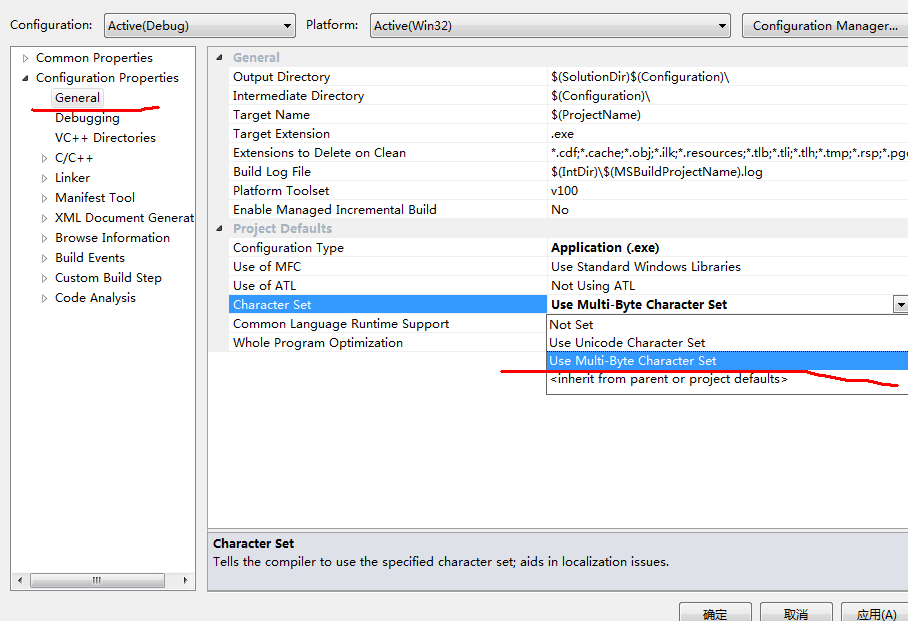
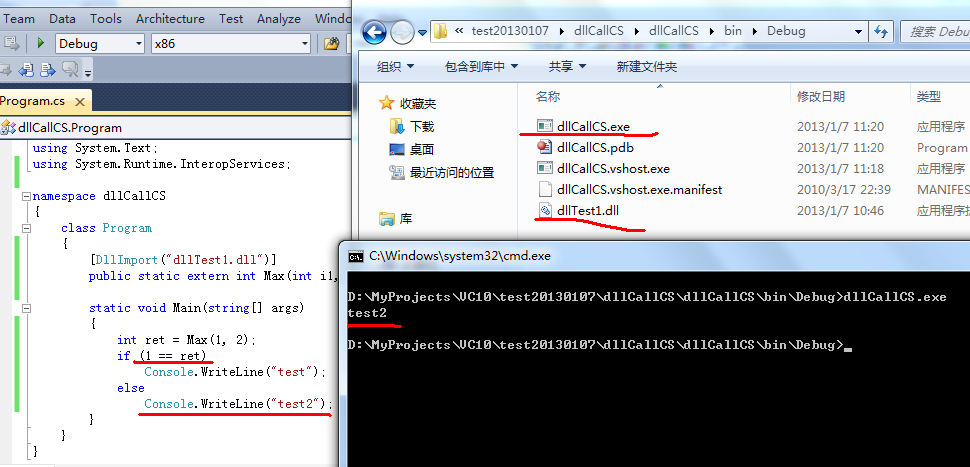
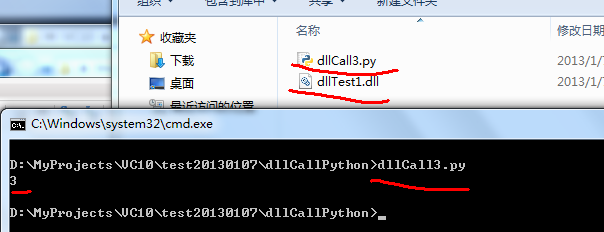

## 一、生成dll(基于VS2010)
1、选择“Win32 Console Application”，建立工程；

2、向导中的“Application type”选择Dll，并在“Additional options”选项中勾选“Empty Project”；

3、点击“Finish”完成向导；

4、添加文件CallTest1.cpp，添加如下代码：

	#include <windows.h>
	
	BOOL APIENTRY DllMain( HANDLE hModule, 
	                       DWORD  ul_reason_for_call, 
	                       LPVOID lpReserved
						 )
	{
	    return TRUE;
	}
	
	extern   "C"  _declspec(dllexport) int Max(int i1,int i2)
	{	
		return (i1>i2)?i1:i2;
	}

5、编译生成dll文件；

## 二、C++调用dll（基于VS2010）
1、选择“Win32 Console Application”，建立工程；
2、向导中的“Application type”选择“Console Application”，并在“Additional options”选项中勾选“Empty Project”；
3、点击“Finish”完成向导；
4、添加文件dllCall.cpp，添加如下代码：

	//dll的显式调用
	
	#include <stdio.h>
	#include <windows.h>
	
	typedef int(*pMax)(int a,int b);
	
	void main(void)
	{
		HINSTANCE hDLL;
		pMax Max;
		hDLL=LoadLibrary("dllTest1.dll");//加载动态链接库文件；
		Max=(pMax)GetProcAddress(hDLL,"Max");
		int a=Max(5,8);
		printf("比较的结果为%d\n",a);
		FreeLibrary(hDLL);//卸载文件；
		getchar();
	} 

5、进入工程的属性选项，选择“Use Multi-Byte Character Set”；

6、编译程序，将dllTest1.dll文件copy到和dllCall.exe同一目录并运行；

## 三、c#调用dll（基于VS2010）
1、选择“Console Application”，建立dllCallCS工程；

2、在Program.cs文件中添加如下代码：
using System.Runtime.InteropServices;

3、导入dll文件：
	[DllImport("dllTest1.dll")]
	public static extern int Max(int i1, int i2);
4、添加测试代码：

	int ret = Max(1, 2);
    if (1 == ret)
        Console.WriteLine("test");
    else
        Console.WriteLine("test2");

5、编译程序，将dllTest1.dll文件copy到和dllCallCS.exe同一目录并运行；

附Program.cs文件完整代码：
	
	using System;
	using System.Collections.Generic;
	using System.Linq;
	using System.Text;
	using System.Runtime.InteropServices;
	
	namespace dllCallCS
	{
	    class Program
	    {
	        [DllImport("dllTest1.dll")]
	        public static extern int Max(int i1, int i2);
	
	        static void Main(string[] args)
	        {
	            int ret = Max(1, 2);
	            if (1 == ret)
	                Console.WriteLine("test");
	            else
	                Console.WriteLine("test2");
	        }
	    }
	}
	
## 四、Python调用dll（基于Python2.7）
1、建立文件dllCall3.py文件，填充如下代码：

	from ctypes import *
	dll = CDLL("dllTest1.dll")
	print dll.Max(1, 3)
	
2、将dllTest1.dll文件复制到该目录，运行程序；

