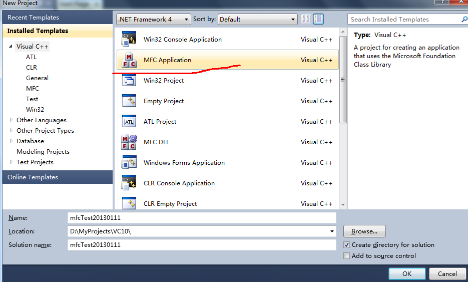
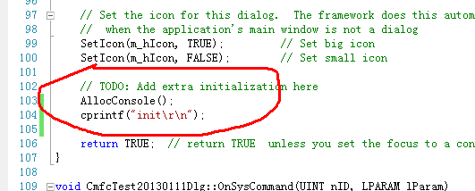
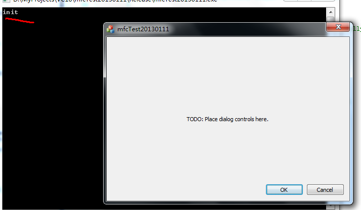
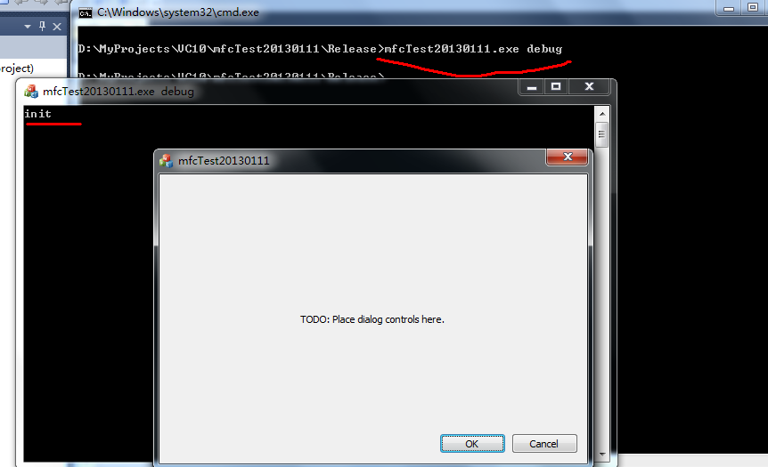
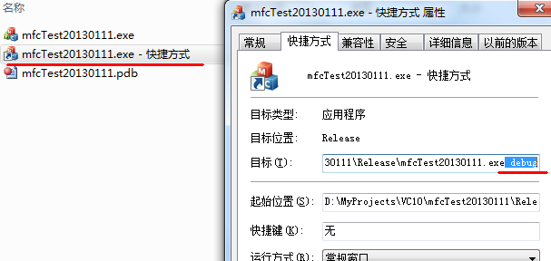

#给MFC程序添加运行时调试窗口

## 一、建立MFC工程
1、选择“MFC Application”，建立工程；

2、向导中的“Application type”选择“Dialog based”；
3、点击“Finish”完成向导；

## 二、添加控制台调试窗口
1、添加头文件：
	
	#include "conio.h"

2、在OnInitDialog函数中添加如下代码：

	AllocConsole();	
	cprintf("init\r\n");

如图所示：

3、编译并运行程序，效果如下：

## 三、添加命令行参数判断
如果发布的程序有个控制台窗口看起来总是怪怪的，这个可以通过给MFC程序添加命令行参数来判断是否开启控制台调试窗口，当然也可以把"AllocConsole();"这行代码注释掉来实现。

我这里有个示例，只是判断了命令行参数个数，这个读者可以根据情况进行修改。
1、在OnInitDialog函数中添加如下代码：

	if(__argc > 1)
	{
		AllocConsole();		
		cprintf("init\r\n");
	}
	
编译并运行程序。
2、运行效果
这里主要演示下带命令行参数的运行效果：

当然也可以创建一个快捷方式，然后在属性中添加参数，双击即可：

