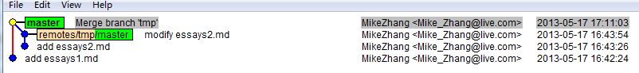
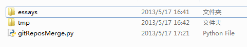

我经常写随笔，有版本控制的参与会很方便，可有时候由于种种原因（比如网络不通等），
我不能clone到本地，而我又要写新的随笔，写的过程中会有很多递交历史，我在合并到随笔文件夹
的时候，也想得到递交历史。

现在模拟下这一场景：
1、建立文件夹essays，并添加随笔essay1.md；
2、建立tmp文件夹，添加新随笔essays2.md,添加内容，并完成多次递交；
现在的问题是，我不只是想要tmp文件夹下东西，它的递交历史我也想要；

步骤如下：

	1、进入essays文件夹，添加远程分支并：
	git remote add tmp ../tmp/
	2、抓取远程分支数据到本地仓库：
	git fetch tmp
	3、产生临时新分支：
	git checkout -b tmp tmp/master
	4、切回master分支：
	git checkout master
	5、将临时新分支合并到master分支：
	git merge tmp 
	6、删除临时分支：
	git branch -d tmp

合并后效果如下：

为了方便使用，我这里整理了下，写成python脚本，代码如下(gitReposMerge.py)：

	#! /usr/bin/python

	import os

	dir1 = "essays"
	dir2 = "../tmp"
	tmpBranchName = "tmp"

	execCommand = os.system

	strCmd1 = "cd %s && git remote add %s %s && git fetch %s  \
	&& git checkout -b  %s %s/master && git checkout master  \
	&& git merge %s && git branch -d %s && cd .." % (dir1,tmpBranchName,dir2, \
	tmpBranchName,tmpBranchName,tmpBranchName,tmpBranchName,tmpBranchName,)
	print strCmd1
	execCommand(strCmd1)

目录结构：

即：脚本和git仓库在同一个目录。

执行gitReposMerge.py脚本即可。
