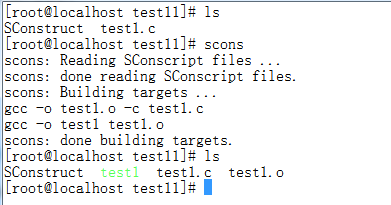

##一、安装scons

Linux环境（以CentOS为例）

1、yum安装
	
	yum install scons

2、源码安装
	
下载scons：[http://http://jaist.dl.sourceforge.net/project/scons/scons/2.3.0/scons-2.3.0.zip](http://http://jaist.dl.sourceforge.net/project/scons/scons/2.3.0/scons-2.3.0.zip )

安装scons：python setup.py install

## 二、scons常用命令

scons -c ： 可以清除生成的临时文件和目标文件，相当于执行make clean。

scons -Q ： 将产生更少的输出信息。

## 三、scons使用示例

1、编译可执行文件

使用Program函数进行可执行文件的编译。

1.1 单文件方式

1.1.1 编写程序代码

建立文件test.c,内容如下：
	
	#include <stdio.h>
	int main()
	{
		printf("Just a test!\n");
		return 0;
	}

1.1.2 编写SConstruct代码

内容如下：
	
	Program("test1.c")

1.1.3 编译程序

执行scons命令进行编译，效果如下：

1.2 多文件方式

1.2.1 编写程序代码

test1.h文件：

	#include <stdio.h>
	void fun11();

test1.c文件：
	
	#include "test1.h"
	void fun11()
	{
		printf("fun11\n");
	}
	
test2.c文件：
	
	#include "test1.h"
	int main()
	{
		fun11();
		return 0;
	}

1.2.2 编写SConstruct代码

内容如下：
	
	Program('test', ['test1.c','test2.c'])
或者：
	
	Program('test',Glob('*.c'))	

1.2.3 编译程序

执行scons命令进行编译。

1.3 依赖

1.3.1 链接库

语法示例如下：

	Program('test', ['test1.cpp'],LIBS=['boost_system','boost_thread-mt'], LIBPATH='/usr/lib64')

1.3.2 包含库

语法示例如下：

	Program('program',Glob('*.c'),CPPPATH='/home/admin/inc')

2、编译静态库

语法示例如下：

	Library('libtest1',['test1.c'])

3、编译动态库

语法示例如下：

	SharedLibrary('libtest1',['test1.c'])

## 三、其它

参考资料

（1）       scons主页：http://www.scons.org/

（2）       scons文档：http://www.scons.org/documentation.php