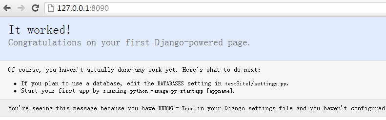
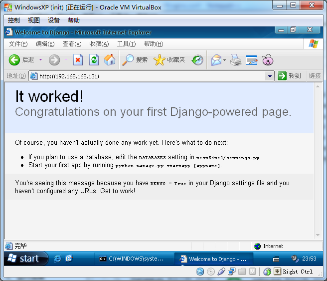

##一、 安装djanjo

1、下载源码

[https://www.djangoproject.com/download/](https://www.djangoproject.com/download/)

本文下载的djanjo版本为1.5.1，下载链接如下：

[https://www.djangoproject.com/m/releases/1.5/Django-1.5.1.tar.gz](https://www.djangoproject.com/m/releases/1.5/Django-1.5.1.tar.gz)

2、安装

进入源码目录执行以下命令：

python setup.py install

3、验证djanjo

	>>> import django
	>>> print(django.__path__)
	['C:\\Python27\\lib\\site-packages\\django']
	>>> print(django.get_version())
	1.5.1

## 二、用djanjo生成简单web页面

1、添加环境变量

将文件django-admin.py所在目录“C:\Python27\Scripts”加入path变量。

2、创建djanjo项目

	django-admin.py startproject testSite1 # 创建diango项目testSite1
	cd testSite1
	manage.py runserver 8090  # 在8090端口提供服务

3、运行效果

这里可以通过127.0.0.1进行访问，但不能通过本机的局域网ip等进行访问。

## 三、用nginx进行代理

1、下载nginx

网址：[http://nginx.org/en/download.html](http://nginx.org/en/download.html)

本文所使用的nginx版本链接：[http://nginx.org/download/nginx-1.4.1.zip](http://nginx.org/download/nginx-1.4.1.zip)

2、配置nginx

进入conf文件夹，打开nginx.conf文件，添加（或修改为）如下内容：

	server {
        listen       80; # 注意端口占用问题
		
		location / {
			proxy_pass http://127.0.0.1:8090;						
		}        
	}

3、运行效果

从图中可以看到，虚拟机可以通过ip地址正常访问网站。