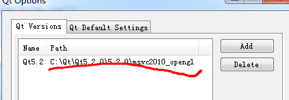
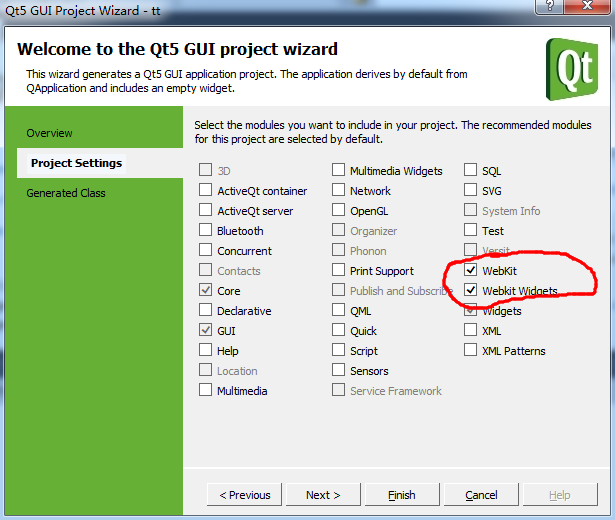

*环境*

	windows7 + VS2010 + QT5.2_opengl

## 配置开发环境

1、安装VS2010

2、安装QT 5.2
	
QT网站：[http://qt-project.org/downloads](http://qt-project.org/downloads)

下载并安装QT5.2：[Qt 5.2.1 for Windows 32-bit (VS 2010, OpenGL, 517 MB)](http://download.qt-project.org/official_releases/qt/5.2/5.2.1/qt-opensource-windows-x86-msvc2010_opengl-5.2.1.exe)

3、安装Visual Studio Add-in for QT5

下载地址：[Visual Studio Add-in 1.2.2 for Qt5](http://download.qt-project.org/official_releases/vsaddin/qt-vs-addin-1.2.2-opensource.exe)

4、配置VS 2010

配置路径：QT5 ==> "Qt Options" ==> "Qt Versions" ==> Add

默认路径为：C:\Qt\Qt5.2.0\5.2.0\msvc2010_opengl

## 解析html

1、建立QtWebkit工程

操作路径：VS2010 ==> File ==> New ==> Project ==> "Qt5 Projects" ==> "Qt Application"

**注意事项**

*在"Project Settings"里面选中“WebKit”和“Webkit Widgets”选项:*

2、添加头文件

	#include <QtGui>
	#include <QtWebKit>
	#include <QWebView>

3、解析内容

3.1、解析http形式的url

使用QWebView的setUrl方法,示例如下：

	QWebView view;
    view.show();
	view.setUrl(QUrl("http://www.cnblogs.com/mikezhang"));

3.2、解析本地文件

使用QWebView的setUrl方法,示例如下：
    
	QWebView view;
    view.show();
	view.setUrl(QUrl("file:///E:/tmp/1.html"));

3.3、解析html字符串

使用QWebView的setHtml方法,示例如下：

	QApplication app(argc, argv);
    QWebView view;
    view.show();
	std::ifstream fin("E:/tmp/1.html");  
	std::stringstream buffer;  
	buffer << fin.rdbuf();  
	fin.close();
	view.setHtml(buffer.str().c_str());

*完整代码如下*：

	#include <QtGui>
	#include <QtWebKit>
	#include <QWebView>
	
	#include <fstream>
	#include <string>
	#include <sstream> 
	
	int main(int argc, char *argv[])
	{
		QApplication app(argc, argv);
	    QWebView view;
	    view.show();

		// Method 1 : a remote url
		//view.setUrl(QUrl("http://www.cnblogs.com/mikezhang"));
	
		// Method 2 : a local url
		//view.setUrl(QUrl("file:///E:/tmp/1.html"));	
	
		// Method 3 : set html content	
		std::ifstream fin("E:/tmp/1.html");  
		std::stringstream buffer;  
		buffer << fin.rdbuf();  
		fin.close();
		view.setHtml(buffer.str().c_str());
	
	    return app.exec();
	}
	

