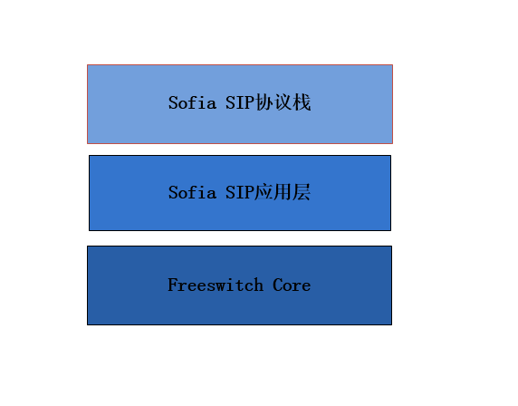
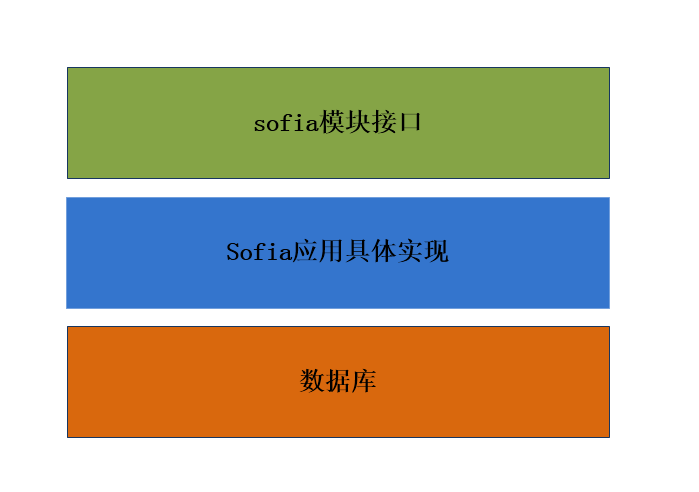
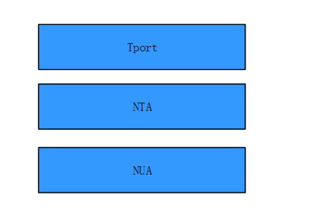
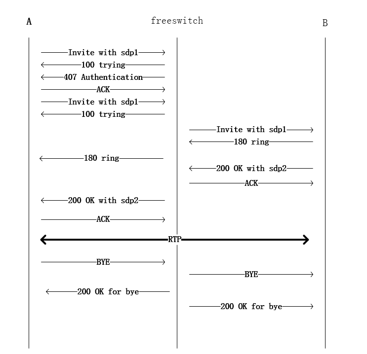

# freeswitch呼叫流程分析

## 整体结构图

## FreeswitchCore
### 模块加载过程
freeswitch主程序初始化时会从modules.conf.xml文件中读取配置，如果配置中如下内容生效：

    <load module="mod_sofia"/>

则执行加载sofia模块操作。

具体过程如下：

    main
    switch_core_init_and_modload
    switch_loadable_module_init
    switch_loadable_module_load_module_ex ： 读取xml文件并加载模块

### 状态机相关

#### 状态机初始化

    switch.c  : main

    switch_core_init_and_modload
    	=> switch_core_init
    		=> switch_core_session_init
    			=> switch_core_session_thread_pool_manager
    				=> check_queue
    					=> switch_core_session_thread_pool_worker
    						=> switch_core_session_thread
    							=> switch_core_session_run   

####　改变状态
通过调用switch_channel_set_state来实现状态机的状态改变。

#### 处理状态变化

当状态发生变化后，通过switch_channel_set_running_state函数来改变running_state，   
并执行相关的回调来通知其状态已经发生改变了：      
endpoint_interface->io_routines->state_run   

##### 主叫状态变化
- CS_NEW

switch_core_session_run初始状态为CS_NEW

-	CS_INIT

    sofia_handle_sip_i_state    
        case nua_callstate_received (收到invite请求)
            修改状态机的状态 ：CS_NEW  ==> CS_INIT
            switch_channel_set_state(channel, CS_INIT);    

    switch_core_session_run    
        状态机处理状态变化
        STATE_MACRO(init, "INIT");
            on_init 即 ： sofia_on_init        
            switch_core_standard_on_init

-	CS_ROUTING   

    sofia_on_init

        修改状态机的状态 ： CS_INIT == > CS_ROUTING
        switch_channel_set_state(channel, CS_ROUTING);

    switch_core_session_run    
        状态机处理状态变化
        STATE_MACRO(routing, "ROUTING");
            on_routing 即 ： sofia_on_routing        
            switch_core_standard_on_routing

-	CS_EXECUTE     

    switch_core_standard_on_routing
        修改状态机的状态 ： CS_ROUTING == > CS_EXECUTE
        switch_channel_set_state(session->channel, CS_EXECUTE);    

    switch_core_session_run    
        状态机处理状态变化
        STATE_MACRO(execute, "EXECUTE");
            on_execute 即 ： sofia_on_execute        
            switch_core_standard_on_execute

-	CS_HANGUP    

    sofia_handle_sip_i_bye
        switch_channel_hangup ： 即 switch_channel_perform_hangup
            修改状态机的状态
            channel->state = CS_HANGUP;

            状态机处理状态变化
            switch_core_session_hangup_state            
                STATE_MACRO(hangup, "HANGUP");

##### 被叫状态变化
-	CS_NEW  

switch_core_session_run初始状态为CS_NEW

-	CS_INIT   

    sofia_outgoing_channel
        修改状态机的状态 ：CS_NEW  ==> CS_INIT
    	switch_channel_set_state(nchannel, CS_INIT);

状态机处理逻辑参考主叫。

-	CS_ROUTING  

    sofia_on_init    
        修改状态机的状态 ： CS_INIT == > CS_ROUTING
        switch_channel_set_state(channel, CS_ROUTING);

状态机处理逻辑参考主叫。

-	CS_CONSUME_MEDIA   

    originate_on_routing
    	修改状态机的状态：CS_ROUTING -> CS_CONSUME_MEDIA
    	switch_channel_set_state(channel, CS_CONSUME_MEDIA);

    switch_core_session_run    
        状态机处理状态变化
        STATE_MACRO(consume_media, "CONSUME_MEDIA");
            on_ consume_media 即 ： NULL
            switch_core_standard_on_consume_media

-	CS_EXCHANGE_MEDIA  

    switch_core_session_run    
        状态机处理状态变化
        STATE_MACRO(exchange_media, "EXCHANGE_MEDIA");
            on_exchange_media 即 ： sofia_on_exchange_media        
            switch_core_standard_on_exchange_media

-	CS_HANGUP

    audio_bridge_on_exchange_media    
        switch_channel_hangup ： 即 switch_channel_perform_hangup
            修改状态机的状态
            channel->state = CS_HANGUP;        

            状态机处理状态变化
            switch_core_session_hangup_state

                STATE_MACRO(hangup, "HANGUP");

## Sofia应用层

### 模块加载过程

启动事件处理线程池 ：

    SWITCH_MODULE_LOAD_FUNCTION(mod_sofia_load)
        => sofia_msg_thread_start(0);
            => sofia_msg_thread_run
                => sofia_process_dispatch_event
                    => our_sofia_event_callback : 处理消息

启动服务器监听 ：                

    SWITCH_MODULE_LOAD_FUNCTION(mod_sofia_load)
        => config_sofia(0, NULL)
            => launch_sofia_profile_thread
                => sofia_profile_thread_run                
                    => nua_create
                        => su_home_new
                        => nua_stack_init                    
                            => nta_agent_create
                                => nta_agent_add_tport                            
                                    => tport_tbind
                                        => tport_bind_server
                                            => tport_listen ： 监听客户端发来的数据     

### 数据表                                            
数据库默认路径：/usr/local/freeswitch/db

freeswitch core 相关：

- aliases
- calls
- channels
- complete
- interfaces
- nat
- recovery
- registrations
- tasks

sofia相关：
- sip_authentication
- sip_dialogs
- sip_presence
- sip_registrations
- sip_shared_appearance_dialogs
- sip_shared_appearance_subscriptions
- sip_subscriptions

limit相关：
- db_data
- group_data
- limit_data

fifo相关：
- fifo_bridge
- fifo_callers
- fifo_outbound

语音信箱相关：
- voicemail_msgs
- voicemail_prefs

### 呼叫流程涉及内容

1、	收到A的nua_i_invite，返回407，具体如下:   

sofia_handle_sip_i_invite => sofia_reg_handle_register => sofia_reg_auth_challenge => 407

2、	收到A的nua_i_invite，返回180，具体如下：    

sofia_handle_sip_i_invite => sofia_reg_handle_register => sofia_reg_parse_auth

处理nua_i_state消息   
sofia.c  :  sofia_handle_sip_i_state    
...    
mod_dialplan_xml.c 	:	 dialplan_hunt    (ring_ready)    
解析拨号方案，执行lua脚本，设置通道变量。     
…     
发送180事件     

涉及数据表：   
sip_registrations、ip_dialogs

3、	发送invite给B分机，具体如下：    
处理nua_r_invite消息    
sofia_handle_sip_r_invite  =>  originate_on_routing     
涉及数据表：     
sip_dialogs      

4、	B应答，双方通话，具体如下：     

    sofia_receive_message : SWITCH_MESSAGE_INDICATE_ANSWER               
        => sofia_answer_channel
            => sofia_glue_tech_choose_port
            => sofia_glue_set_local_sdp
            => sofia_glue_activate_rtp

### 编码协商过程
这里描述下后协商流程    

- 先匹配freeswitch默认的codec，从加载的模块中查找支持类型的具体码率信息      

sofia_handle_sip_i_invite      
    => sofia_glue_tech_prepare_codecs        
       => switch_loadable_module_get_codecs_sorted             

- 协商发给被叫的sdp    

sofia_glue_do_invite     
    => sofia_glue_tech_prepare_codecs     
        => switch_loadable_module_get_codecs_sorted     

        ocodec + codec_string     

- 产生M头，并发送包含sdp的invite         

sofia_glue_do_invite     
=> sofia_glue_set_local_sdp     
=> generate_m                    
=> nua_invite     

- 协商200 OK的sdp      

sofia_answer_channel     
  => sofia_glue_tech_prepare_codecs     
      => switch_loadable_module_get_codecs_sorted     

### 媒体交互              

- RTP数据交互

audio_bridge_on_exchange_media     
  => audio_bridge_thread     

收发音频数据            
=> switch_core_session_read_frame     
  => session->endpoint_interface->io_routines->read_frame 即： sofia_read_frame     

=> switch_core_session_write_frame         
  => perform_write     
      => session->endpoint_interface->io_routines->write_frame 即： sofia_write_frame     

收发视频数据     
1、启动线程     
=> launch_video         
=> video_bridge_thread     

2、收发数据     
=> switch_core_session_read_video_frame     
=>session->endpoint_interface->io_routines->read_video_frame     
即：sofia_read_video_frame     

=> switch_core_session_write_video_frame     
=> session->endpoint_interface->io_routines->write_video_frame     
即：sofia_write_video_frame     

- 终止RTP交互     

audio_bridge_thread     
  => switch_core_session_kill_channel(session_b, SWITCH_SIG_BREAK);     
      即 ：switch_core_session_perform_kill_channel     
      =>  session->endpoint_interface->io_routines->kill_channel     
      即 : sofia_kill_channel     
          => switch_rtp_break     

## Sofia协议栈

### 协议栈结构图

NUA		:	 基本的SIP用户代理的功能，其功能包括呼叫管理，消息和事件检索。      
NTA	    :	 sofia SIP事务API（NTA）提供了简单的接口的SIP事务，传输和信息处理。     
Tport	:	 该模块包含一个由SIP，RTSP 和HTTP协议使用的通用传输接口，这是一个协议栈和传输协议实现之间的抽象层。    

### SIP信令具体流程
   

场景描述： A 呼叫 B ，B接通后通话一段时间后，挂断电话。

- A 发送 INVITE 请求 

tport.c : 	 tport_recv_data    
nta.c :    agent_recv_request   

- FS回应100给A分机

nua_server.c :		nua_stack_process_request    
nua_server.c :		SR_STATUS1(sr, SIP_100_TRYING)     
nta.c : 			nta_incoming_treply   
nta.c : 			incoming_reply    
tport.c:			tport_tsend   

- FS发送认证请求给A分机      

nua_application_event    

处理nua_i_invite 消息   

sofia.c : sofia_process_dispatch_event    
sofia.c : our_sofia_event_callback   
sofia.c : sofia_handle_sip_i_invite   
sofia.c : sofia_reg_handle_register  
sofia_reg.c : sofia_reg_auth_challenge    

回复407    

nua.c : nua_respond     
nua_stack.c : nua_signal     
nua_stack.c : nua_stack_signal    
nua_server.c : nua_stack_respond     
nua_server.c : nua_server_respond    

发送407给A分机    

nua_invite_server_respond    
    nua_base_server_respond    
        nta_incoming_mreply    
            incoming_reply    
                tport_tsend    
                    tport_resolve    
                    tport_by_addrinfo    
                    tport_prepare_and_send    
                        tport_send_msg    
                            tport_vsend                    
                sent 407 Proxy Authentication Required for INVITE (1)        

call state(A)  :  	init -> received    
call state(A) 	:	received -> terminated    
    
- A分机发送ACK       
nta.c : agent_recv_message    
nta.c : agent_recv_request    

- A分机重新发送 INVITE 请求，附加认证信息         
tport.c : 	 tport_recv_data    
nta.c :    agent_recv_request    

- FS回应100给A分机      

nua_server.c :		nua_stack_process_request    
nua_server.c :		SR_STATUS1(sr, SIP_100_TRYING)      
nta.c : 			nta_incoming_treply    
nta.c : 			incoming_reply    
tport.c:			tport_tsend    

- FS发送 INVITE 给 B分机   

switch_ivr_originate.c :  switch_ivr_originate   
                            
sofia_on_init    
sofia_glue_do_invite    
nua_invite :    nua_r_invite 消息    
nua_signal    

sofia.c : sofia_process_dispatch_event    
sofia.c : our_sofia_event_callback        
sofia.c : sofia_handle_sip_r_invite        
...    
sofia_on_init    
sofia_on_routing    
switch_ivr_originate.c ：originate_on_routing    
...    
nua_stack_signal    
nua_stack_invite    
...    
nta_leg_tcreate    
...    
执行发送invite请求    
nta.c : outgoing_send    
tport_tsend    
    
call state(B)		:		init -> calling    
    
- B分机回应180给FS       
tport_recv_event    
agent_recv_response    

处理 nua_r_invite 消息    

sofia.c : sofia_process_dispatch_event    
sofia.c : our_sofia_event_callback    
sofia.c : sofia_handle_sip_r_invite     
    
call state(B)		:		 calling -> proceeding    

- FS发送180给A分机 

nua_session.c	: signal_call_state_change     
nua_stack_tevent 	:	nua_i_state    
nua_application_event    

处理nua_i_invite 消息    

sofia.c : sofia_process_dispatch_event    
sofia.c : our_sofia_event_callback    
sofia.c : sofia_handle_sip_i_invite    
sofia_reg.c : sofia_reg_handle_register    
sofia_reg.c : sofia_reg_parse_auth    

处理nua_i_state消息    
sofia.c  :  sofia_handle_sip_i_state    
...    
mod_dialplan_xml.c 	:	 dialplan_hunt    (ring_ready)    
解析拨号方案，执行lua脚本，设置通道变量。    
…    
    
发送180    
switch_channel_mark_ring_ready     

nua_invite_server_respond    
    nua_base_server_respond    
        nta_incoming_mreply    
            incoming_reply                    
                tport_tsend    
                    tport_resolve    
                    tport_by_addrinfo    
                    tport_prepare_and_send    
                        tport_send_msg    
                            tport_vsend    

call state(A)		:	init -> received    
    
	B发送200 ok    
tport_recv_event    
agent_recv_response    
    
处理 nua_r_invite 消息    

sofia.c : sofia_process_dispatch_event    
sofia.c : our_sofia_event_callback    
sofia.c : sofia_handle_sip_r_invite        

call state(B)		:	 	proceeding -> completing    

- FS发送ACK给B       
nua_ack    
nua_signal : nua_r_ack    
outgoing_send    
tport_tsend    

call state(A)		:		received -> early    
call state(B)		:		completing -> ready    

- FS发送200 OK给A      
sofia_glue_tech_set_codec    
switch_rtp_create    
sofia_glue_negotiate_sdp    
sofia_glue_activate_rtp    
...    
switch_channel_perform_answer   :    SWITCH_MESSAGE_INDICATE_ANSWER    
switch_channel_perform_mark_answered     
...    
auto_record.lua ： 执行录音操作B    
...    
auto_record.lua ： 执行录音操作A    
...    
sofia_receive_message (SWITCH_MESSAGE_INDICATE_ANSWER)    
...    
发送200 OK    
nua_respond : 200    
nua_signal : nua_r_respond    
nua_stack_signal    
nua_stack_respond    
nua_server_respond    
nta_incoming_treply    
nta_incoming_mreply    
incoming_reply    
tport_tsend    
    
call state(A) 	:	 early -> completed    

- A回应ACK       
nta.c : agent_recv_message    
nta.c : agent_recv_request    

call state(A)	:	 completed -> ready    

- 通话一段时间后，A主动发送BYE    
tport_recv_event    
agent_recv_message    
agent_recv_request    
...    
sofia_on_hangup    

- FS发送BYE给B      
nua_bye : nua_r_bye    
nua_stack_signal    
outgoing_send    
tport_tsend    

- FS发送200 OK给A    
nta ： sent 200 OK for BYE    
tport_tsend    
    
call state(A)	:	 ready -> terminating    
call state(A)	: 	 terminated    

- B发送200 OK给FS，回应挂断请求      
nta: received 200 OK for BYE    
    
状态变化：    
call state(B) 	:	 ready -> terminating    
call state(B)	:	 terminating -> terminated    

