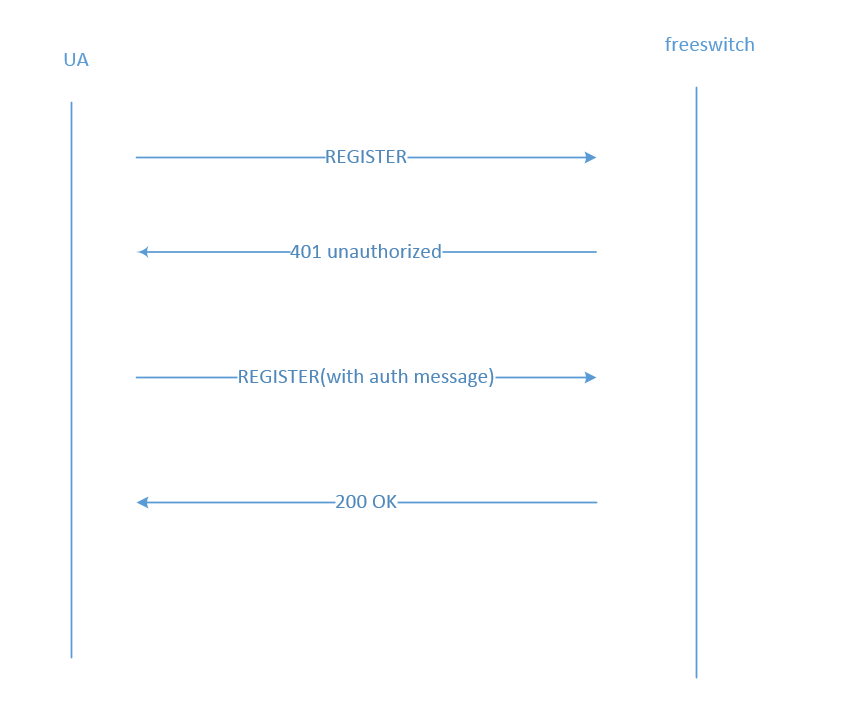

# freeswitch注册过程分析

操作系统：debian8.5_x64     
freeswitch 版本 ： 1.6.8     

本文仅描述sip注册的简单场景，即话机直接向处于同一个局域网的fs进行注册。

## SIP协议的消息结构

### 消息框架
SIP协议是基于文本的协议，SIP协议的消息都遵从一个统一的消息结构：
起始行（Start-Line）、一个或多个头域（Message-Header）、表明域结束的空行（CRLF），以及
可选的消息体（Message-Body）        

    Start-Line
    * Message-Header
    CRLF
    [Message-Body]

### 消息头结构
SIP协议定义了大量的消息头域，但在一个基本SIP请求中至少应该包含以下几个消息体头域：

From ： 请求发起端地址      
To : 请求目的端地址            
Call-ID ： 呼叫标识          
Contract ：联系人信息             
CSeq ： 消息序号             
Max-Forward ：TTL，防止死循环          
Via ： 消息转发记录            
Content-Length : 消息体长度    

### 消息体结构

SIP协议并没有规定消息体的结构，对消息体的应用完全取决于应用自身。

## sip协议REGISTER请求格式

    01  REGISTER sip:{remote_ip} SIP/2.0
    02  Via: {viaInfo}
    03  Max-Forwards: 70
    04  From: {uacInfo}
    05  To: {uasInfo}
    06  Call-ID: {call_id}
    07  User-Agent: {uaInfo}
    08  CSeq: {csnum}
    09  Contact: {contractInfo}
    10  Expires: {expireSeconds}
    11  Authorization: {authInfo}
    12  Content-Length: {msgBodyLength}

- 第1行的REGISTER表示这是一条注册消息
- 第2行的via表示sip消息的路由
- 第3行指出消息最多可以转发多少次，防止死循环
- 第4行至第9行参考前面的消息头结构
- 第10行说明本次注册的有效期，单位为秒
- 第11行是sip认证信息，发送第一次sip register 请求时没有该字段
- 第12行sip消息体的长度，一般为0

## 注册流程

### 终端向服务器发送REGISTER请求

sip消息示例：

    REGISTER sip:192.168.168.85 SIP/2.0
    Via: SIP/2.0/UDP 192.168.168.168:25338;branch=z9hG4bK-d87543-1a71103b47634958-1--d87543-;rport
    Max-Forwards: 70
    Contact: <sip:1000@192.168.168.168:25338;rinstance=196b0ce810f2e6f5>
    To: "1000"<sip:1000@192.168.168.85>
    From: "1000"<sip:1000@192.168.168.85>;tag=2d1fbf20
    Call-ID: ZTRiYTBhZmVlYTM1ZDkxOWQ3OWNkNjkwMmYxMWI5Yjk.
    CSeq: 1 REGISTER
    Expires: 3600
    Allow: INVITE, ACK, CANCEL, OPTIONS, BYE, REFER, NOTIFY, MESSAGE, SUBSCRIBE, INFO
    User-Agent: eyeBeam release 1010f stamp 39239
    Content-Length: 0

### 服务器回复401，并给出WWW-Authenticate信息

    sofia协议栈：
        tport :
            tport_recv_event
                => tport_deliver

        nta :
            agent_recv_request
                => agent_aliases

        nua :
            nua_stack_process_request      

    sofia 应用层：
        sofia_reg_handle_sip_i_register
            => sofia_reg_handle_register_token
                => sofia_reg_auth_challenge (回复401)

sip消息示例：

    SIP/2.0 401 Unauthorized
    Via: SIP/2.0/UDP 192.168.168.168:25338;branch=z9hG4bK-d87543-1a71103b47634958-1--d87543-;rport=25338
    From: "1000" <sip:1000@192.168.168.85>;tag=2d1fbf20
    To: "1000" <sip:1000@192.168.168.85>;tag=m6ecFK1Fy3F0a
    Call-ID: ZTRiYTBhZmVlYTM1ZDkxOWQ3OWNkNjkwMmYxMWI5Yjk.
    CSeq: 1 REGISTER
    User-Agent: FreeSWITCH-mod_sofia/1.6.8+git~20160505T153832Z~99de0ad502~64bit
    Allow: INVITE, ACK, BYE, CANCEL, OPTIONS, MESSAGE, INFO, UPDATE, REGISTER, REFER, NOTIFY, PUBLISH, SUBSCRIBE
    Supported: timer, path, replaces
    WWW-Authenticate: Digest realm="192.168.168.85", nonce="d54e4bb9-fc22-4e08-8b69-442e1b8774eb", algorithm=MD5, qop="auth"
    Content-Length: 0

### 终端再次向服务器发送REGISTER请求，并携带认证信息

    REGISTER sip:192.168.168.85 SIP/2.0
    Via: SIP/2.0/UDP 192.168.168.168:25338;branch=z9hG4bK-d87543-6371fe0e115be271-1--d87543-;rport
    Max-Forwards: 70
    Contact: <sip:1000@192.168.168.168:25338;rinstance=196b0ce810f2e6f5>
    To: "1000"<sip:1000@192.168.168.85>
    From: "1000"<sip:1000@192.168.168.85>;tag=2d1fbf20
    Call-ID: ZTRiYTBhZmVlYTM1ZDkxOWQ3OWNkNjkwMmYxMWI5Yjk.
    CSeq: 2 REGISTER
    Expires: 3600
    Allow: INVITE, ACK, CANCEL, OPTIONS, BYE, REFER, NOTIFY, MESSAGE, SUBSCRIBE, INFO
    User-Agent: eyeBeam release 1010f stamp 39239
    Authorization: Digest username="1000",realm="192.168.168.85",nonce="d54e4bb9-fc22-4e08-8b69-442e1b8774eb",uri="sip:192.168.168.85",response="c46ae8e7eaa2ee63a1d61bf575d8c395",cnonce="71c1997e810fc38b53b97fbb33dc8b1e",nc=00000001,qop=auth,algorithm=MD5
    Content-Length: 0

### 服务器认证后回复200

#### fs处理过程描述     

sofia协议栈：

    tport :
        tport_recv_event
            => tport_deliver

    nta :
        agent_recv_request
            => agent_aliases

    nua :
        nua_stack_process_request      

sofia应用层：

    sofia_reg_handle_sip_i_register
        => sofia_reg_handle_register_token
            => sofia_reg_parse_auth (执行认证操作) for_the_sake_of_interop标签附近

认证成功后发送200 OK给客户端。

#### 认证算法描述          

具体的认证过程可以参考sofia_reg_parse_auth函数，这里描述下sip注册的认证算法。          
sip注册认证使用的是www-authenticate认证算法，具体可参考RFC2617文档。下面进行简单的描述   

对用户名、认证域(realm)以及密码的合并值计算 MD5 哈希值，结果称为 HA1。             
对HTTP方法以及URI的摘要的合并值计算 MD5 哈希值，例如，"REGISTER" 和 "sip:192.168.1.80"，结果称为 HA2。                        
对 HA1、服务器密码随机数(nonce)、请求计数(nc)、客户端密码随机数(cnonce)、保护质量(qop)以及 HA2 的合并值计算 MD5 哈希值。结果即为客户端提供的 response 值。
response 值由三步计算而成。当多个数值合并的时候，使用冒号作为分割符。

计算HA1

    HA1 = MD5(A1) = MD5(username:realm:password)

计算HA2    

    如果qop值为"auth"或未指定，那么HA2为

        HA2 = MD5(A2) = MD5(method:digestURI)

    如果qop值为"auth-init"，那么HA2为

        HA2 = MD5(A2) = MD5(method:digestURI:MD5(entityBody))

计算response

    如果qop值为"auth"或"auth-init"，那么response为

        response = MD5(HA1:nonce:nonceCount:clientNonce:qop:HA2)

    如果qop未知道，那么response为

        response = MD5(HA1:nonce:HA2)

## sip注册涉及数据库

- sip_authentication      

- sip_registrations

## 注册过程模拟

python模拟注册过程

    #! /usr/bin/env python
    #-*- coding:utf-8 -*-

    import sys,socket,time,traceback
    import uuid
    import hashlib

    svrIp,svrPort = "192.168.168.85",5060
    transportType = "udp"
    localIp,localPort = "192.168.168.168",17061
    uid,passwd = "1000","1234"
    g_branch,g_callId = uuid.uuid1(),uuid.uuid1()

    def getRegHeader(seqNum):
        retStr = "REGISTER sip:{remote_ip} SIP/2.0\r\n"
        retStr += "Via: SIP/2.0/{transport} {local_ip}:{local_port};branch={branch}\r\n"
        retStr += "Max-Forwards: 70\r\n"
        retStr += "From: {uid} <sip:{uid}@{remote_ip}:{remote_port}>;tag={call_number}\r\n"
        retStr += "To: {uid} <sip:{uid}@{remote_ip}:{remote_port}>\r\n"
        retStr += "Call-ID: {call_id}\r\n"
        retStr += "User-Agent: fs testing\r\n"
        retStr += "CSeq: %d REGISTER\r\n"%seqNum
        retStr += "Contact: sip:{uid}@{local_ip}:{local_port}\r\n"
        retStr += "Expires: 3600\r\n"
        return retStr

    def formatRegHeader(patternStr):
        retstr = patternStr.format(
            remote_ip=svrIp,
            transport=transportType,
            local_ip=localIp,
            local_port=localPort,
            branch=g_branch,
            uid=uid,
            remote_port=svrPort,
            call_number=uid,
            call_id=g_callId)
        return retstr

    class SipRegObj(object):
        def __init__(self,uid,passwd,
            realm="",nonce="",algorithm="MD5",qop="auth"):
            self.uid = uid # "1000"
            self.password = passwd # "1234"
            self.realm = realm
            self.nonce = nonce
            self.algorithm = algorithm
            self.qop = qop
            self.uri = ""
            self.method = "REGISTER"
            self.cnonce = ""
            self.nc = "00000001"  
            self.svrIp = svrIp
            #self.transportType = "udp"

        def getReponse(self):    
            md5 = hashlib.md5
            ha1 = md5("%s:%s:%s"%(self.uid,self.realm,self.password)).hexdigest()
            ha2 = md5("%s:%s"%(self.method,self.uri)).hexdigest()    
            reponse = md5("%s:%s:%s:%s:%s:%s"%(ha1,self.nonce,self.nc,self.cnonce,self.qop,ha2)).hexdigest()
            return reponse

        def getAuthStr(self):    
            self.uri,self.cnonce = ("sip:%s"%self.svrIp),uuid.uuid1()
            retStr = ""
            response = self.getReponse()
            retStr += 'Authorization: Digest username="%s",realm="%s",nonce="%s",uri="%s",response="%s",cnonce="%s",nc=%s,qop=%s,algorithm=%s\r\n'%(
                self.uid,self.realm,self.nonce,self.uri,response,self.cnonce,self.nc,self.qop,self.algorithm)
            retStr += 'Content-Length: 0\r\n'
            return retStr

        def genChallengeMsg(self):
            # gen sip reg challenge message
            str1=getRegHeader(1) + "Content-Length: 0\r\n"        
            return formatRegHeader(str1)        

        def genAuthMsg(self,retstr1):
            # parse data
            data1 = retstr1.split("\r\n")[-4].split(": Digest")[1]
            data1 = str(data1).replace('MD5','"MD5"')
            tmpList = data1.split(",")
            for item in tmpList :
                #print item
                arrtmp = item.split("=")
                setattr(self,arrtmp[0].strip(),arrtmp[1].strip('"'))                     
            # gen sip reg message with auth
            str2=getRegHeader(2)
            str2 = formatRegHeader(str2)          
            str2 += self.getAuthStr()
            return str2

    if __name__ == "__main__":
        treg = SipRegObj(uid,passwd)

        client = socket.socket(socket.AF_INET, socket.SOCK_DGRAM)
        client.bind((localIp,localPort))
        dstHost = (svrIp,svrPort)

        client.sendto(treg.genChallengeMsg(),dstHost)
        print time.time(),' : send success'

        # get response (401 msg)
        retstr1 = client.recv(1024)
        print retstr1

        client.sendto(treg.genAuthMsg(retstr1),dstHost)
        print time.time(),' : send success'

        retstr2 = client.recv(1024)
        print "return str : \r\n",retstr2

        time.sleep(30)
