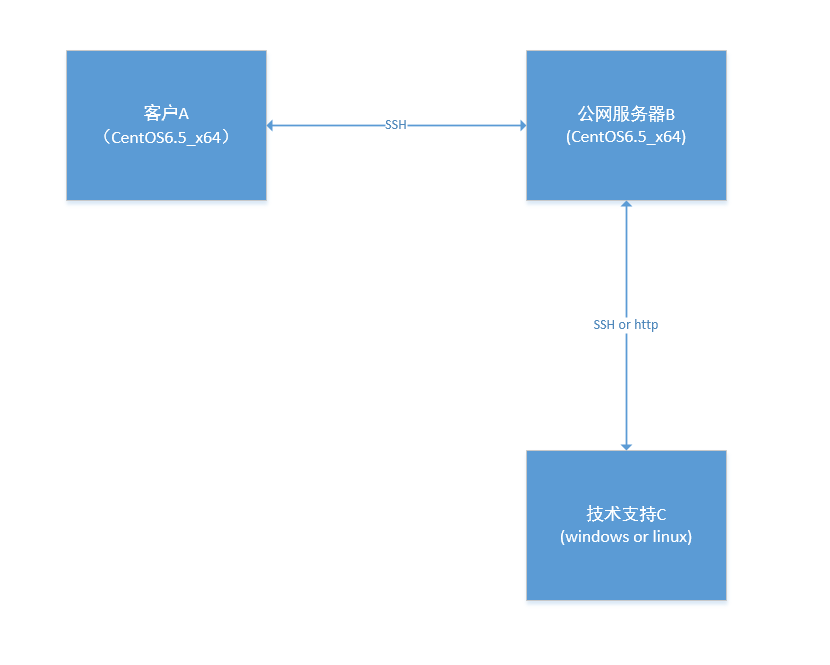
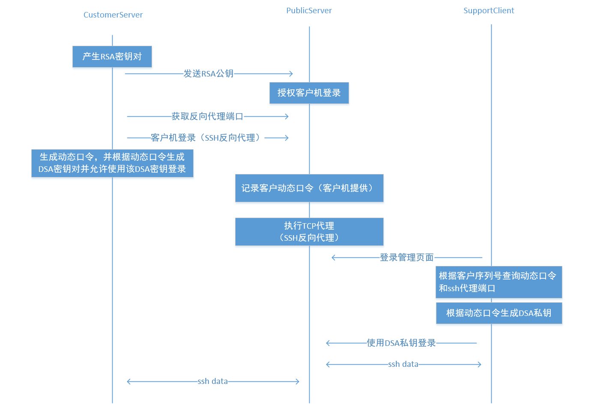
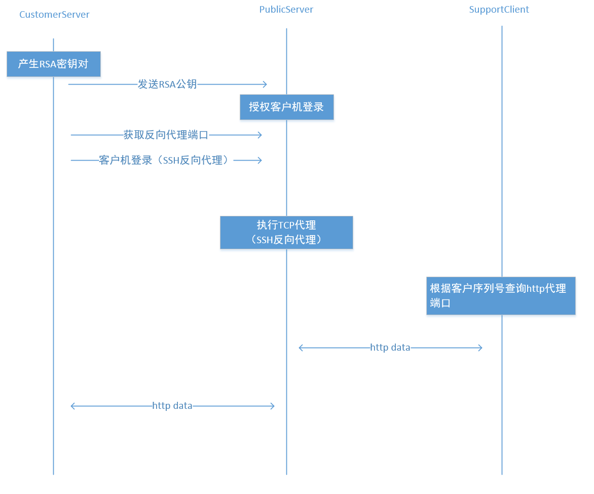

# 基于ssh反向代理实现的远程协助

本文描述了怎么通过ssh反向代理实现远程协助，并提供了相关代码。    
可满足web开启远程协助功能后，维护人员能够通过ssh和http登录客户机器（包括在nat环境下）
* web开启该功能后，ssh才能登录；     
* 通过标识能够区分不同的机器；     
* 能够穿nat；

操作系统： CentOS 6.5_x64    

整体结构如下：

主要成员如下：

* 客户A

  购买公司产品的客户服务器

* 服务器B

  公司公网服务器

* 技术支持人员C

  公司员工电脑

## 端口代理

通过ssh反向代理实现端口转发，这里描述下思路。

### SSH端口代理  

### HTTP端口代理

## 密钥管理

### RSA密钥管理

密钥用途：客户机器使用RSA key执行ssh反向代理本地端口
*	私钥管理

  私钥产生位置：客户机器     
  私钥存储位置：客户机器    

  私钥在客户机保存，新生成密钥对时执行覆盖操作。

*	公钥管理      
  公钥产生位置：客户机器     
  公钥存储位置：公网服务器      

公钥添加过程如下：     
1、	公网服务器收到客户机发来的含RSA公钥的消息；      
2、	从消息中取出客户序列号；       
3、	验证客户序列号是否合法；         
4、	如果序列号合法，将RSA公钥加入authorized_keys文件，并在公钥字符串后面加入超时信息；         

公钥删除过程如下：         
1、从authorized_keys文件取出公钥；         
2、判断公钥是否超时；       
3、删除超时的公钥；        

### DSA密钥管理

密钥用途：     
使用此密钥通过跳板机连接到NAT后面的客户机。   

*	私钥管理          
私钥产生位置：support机器            
私钥存储位置：support机器          

* 公钥管理        
公钥产生位置：客户机器       
公钥存储位置：客户机器         

私钥产生过程：         
1、获取客户机页面显示的动态密码；
2、以动态密码为seed产生DSA私钥（存储后用于ssh登录客户机）；

公钥添加过程如下：       
1、随机产生动态密码；         
2、以动态密码为seed产生DSA公钥；            
3、将产生的DSA公钥加入authorized_keys文件（不能在key字符串前面加入command命令，否则无法执行command），并设置超时时间；       

公钥删除过程：       
1、从authorized_keys文件取出公钥；           
2、判断公钥是否超时；         
3、删除超时的公钥；          

## 连接管理
### IP地址限制
适用范围：在公网服务器上配置，用于控制support机器ip地址来源。         

提供配置项，用于记录允许的IP地址；    
新的请求到来时，验证下原地址是否合法，如果不是合法地址，直接断开连接；       

### SSH连接管理
*	客户侧ssh连接管理      
ssh命令允许在末尾执行command，当command执行完成时，ssh断开。        
可借助这个特性在ssh命令的末尾调用python脚本，调用一个python程序，执行sleep操作，python程序退出时ssh连接断开。

*	Support侧ssh连接管理       
如果客户侧的ssh断开，support侧的ssh连接也会断开，support侧的ssh连接可以不用过多管理，仅需在客户机的authorized_keys进行连接时长的限制。

## 其它
1、通过命令执行SSH反向代理时，服务端只能通过127.0.0.1

该问题可以通过服务端配置实现ssh监听0.0.0.0，具体配置如下：

GatewayPorts yes

2、公网服务器remote账号相关命令   

::

      useradd remote
      chgrp remote /root
      su remote
      ssh-keygen -t rsa
      cd .ssh/    
      touch authorized_keys
      chmod 600 authorized_keys
