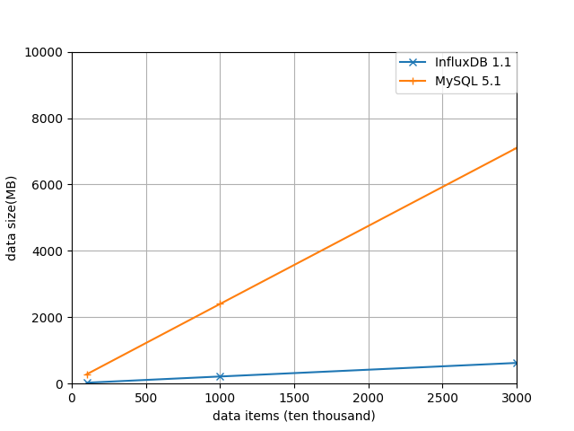
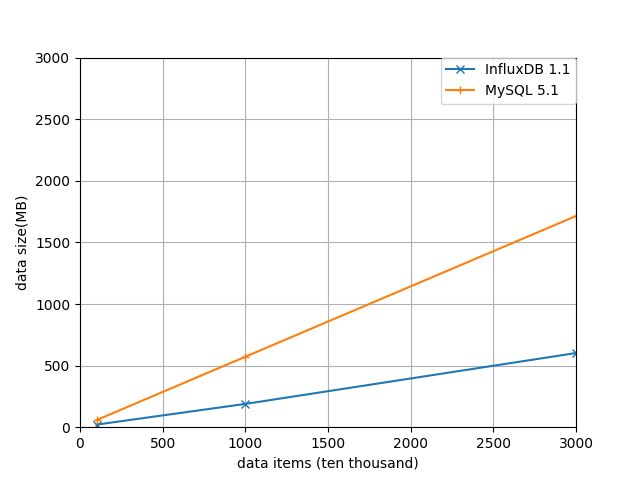
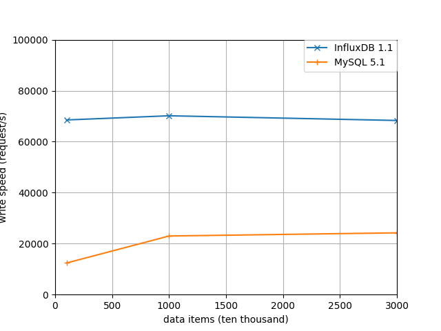
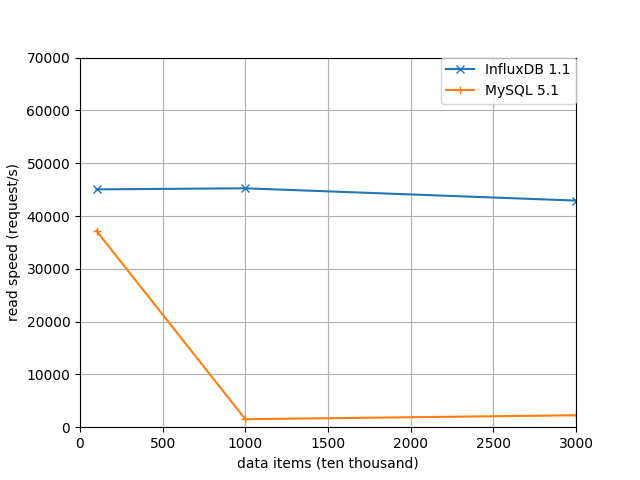

# InfluxDB读写性能测试

今天进行了InfluxDB和MySQL的对比测试，这里记录下结果，也方便我以后查阅。

操作系统： CentOS6.5_x64   
InfluxDB版本 ： v1.1.0     
MySQL版本：v5.1.73       
CPU ： Intel(R) Core(TM) i5-2320 CPU @ 3.00GHz         
内存 ：12G     
硬盘 ：SSD       

## MySQL读写测试

### 测试准备

初始化SQL语句：           

    CREATE DATABASE testMysql;
    CREATE TABLE `monitorStatus` (
        `system_name` VARCHAR(20) NOT NULL,
        `site_name` VARCHAR(50) NOT NULL,
        `equipment_name` VARCHAR(50) NOT NULL,
        `current_value` DOUBLE NOT NULL,
        `timestamp` BIGINT(20) NULL DEFAULT NULL,
        INDEX `system_name` (`system_name`),
        INDEX `site_name` (`site_name`),
        INDEX `equipment_name` (`equipment_name`),
        INDEX `timestamp` (`timestamp`)
    )
    ENGINE=InnoDB;

单写测试代码（insertTest1.c）：

    #include <stdlib.h>  
    #include <stdio.h>  
    #include <time.h>
    #include "mysql/mysql.h"

    #define N 100

    int main()
    {
        MYSQL *conn_ptr;  
        int res;  
        int t,i,j;
        int64_t tstamp = 1486872962;		
        srand(time(NULL));
        t=0;
        conn_ptr = mysql_init(NULL);  
        if (!conn_ptr)
        {  
            printf("mysql_init failed\n");  
            return EXIT_FAILURE;  
        }  
        conn_ptr = mysql_real_connect(conn_ptr,"localhost","root","","testMysql",0,NULL,0);  
        if (conn_ptr)
        {  
            for(i=1;i<= 10000;i++)
            {
                mysql_query(conn_ptr,"begin");
                for(j=0;j<N;j++,t++)
                {
                    char query[1024]={0};

                    sprintf(query,"insert into monitorStatus values ('sys_%d','s_%d','e_%d','0.%02d','%lld');",
                        //j%10,(t+i)%10,(t+j)%10,(t+i+j)%100,tstamp);
                        j%10,(t+i)%10,(t+j)%10,rand()%100,tstamp);
                    //printf("query : %s\n",query);
                    res = mysql_query(conn_ptr,query);

                    if (!res)
                    {   
                        //printf("Inserted %lu rows\n",(unsigned long)mysql_affected_rows(conn_ptr));   
                    }
                    else
                    {   
                        fprintf(stderr, "Insert error %d: %sn",mysql_errno(conn_ptr),mysql_error(conn_ptr));  
                    }
                    if(j%10 == 0) tstamp+=1;
                }
                mysql_query(conn_ptr,"commit");
                //printf("i=%d\n",i);
            }
        }
        else
        {  
            printf("Connection failed\n");  
        }  
        mysql_close(conn_ptr);  
        return EXIT_SUCCESS;  
    }

可根据情况调整测试代码中的N参数。

单读测试代码（queryTest1.c）：

    #include <stdio.h>  
    #include <stdlib.h>  
    #include "mysql/mysql.h"

    int main()
    {  
        MYSQL *conn_ptr;  
        MYSQL_RES *res_ptr;  
        MYSQL_ROW sqlrow;  
        MYSQL_FIELD *fd;  
        int res, i, j;  

        conn_ptr = mysql_init(NULL);  
        if (!conn_ptr)
        {  
            return EXIT_FAILURE;  
        }  
        conn_ptr = mysql_real_connect(conn_ptr,"localhost","root","","testMysql", 0, NULL, 0);  
        if (conn_ptr)
        {  
            res = mysql_query(conn_ptr,"select * from `monitorStatus` where system_name='sys_8' and site_name='s_9' and equipment_name='e_6' order by timestamp desc limit 10000;");

            if (res)
            {         
                printf("SELECT error:%s\n",mysql_error(conn_ptr));     
            }
            else
            {        
                res_ptr = mysql_store_result(conn_ptr);             
                if(res_ptr)
                {               
                    printf("%lu Rows\n",(unsigned long)mysql_num_rows(res_ptr));   
                    j = mysql_num_fields(res_ptr);          
                    while((sqlrow = mysql_fetch_row(res_ptr)))  
                    {  
                        continue;
                        for(i = 0; i < j; i++)         
                            printf("%s\t", sqlrow[i]);                
                        printf("\n");          
                    }              
                    if (mysql_errno(conn_ptr))
                    {                      
                        fprintf(stderr,"Retrive error:s\n",mysql_error(conn_ptr));               
                    }        
                }        
                mysql_free_result(res_ptr);        
            }  
        }
        else
        {  
            printf("Connection failed\n");  
        }  
        mysql_close(conn_ptr);  
        return EXIT_SUCCESS;  
    }  

Makefile文件：

    all:
        gcc -g insertTest1.c -o insertTest1 -L/usr/lib64/mysql/ -lmysqlclient
        gcc -g queryTest1.c -o queryTest1 -L/usr/lib64/mysql/ -lmysqlclient

    clean:
        rm -rf insertTest1
        rm -rf queryTest1    

###  测试数据记录

磁盘空间占用查询：

使用du方式（新数据库，仅为测试）：      

    du -sh /var/lib/mysql

查询特定表：      

    use information_schema;
    select concat(round(sum(DATA_LENGTH/1024/1024), 2), 'MB') as data from TABLES where table_schema='testMysql' and table_name='monitorStatus';

测试结果：

* 100万条数据

    [root@localhost mysqlTest]# time ./insertTest1

    real	1m20.645s
    user	0m8.238s
    sys	0m5.931s

    [root@localhost mysqlTest]# time ./queryTest1
    10000 Rows

    real	0m0.269s
    user	0m0.006s
    sys	0m0.002s

原始数据 :    28.6M         
du方式 :      279MB         
sql查询方式： 57.59MB        
写入速度： 12398 / s			
读取速度： 37174 / s		

* 1000万条数据

	root@localhost mysqlTest]# time ./insertTest1

	real	7m15.003s
	user	0m48.187s
	sys	0m33.885s

	[root@localhost mysqlTest]# time ./queryTest1
	10000 Rows

	real	0m6.592s
	user	0m0.005s
	sys	0m0.002s

原始数据 :    286M        
du方式 :      2.4G        
sql查询方式： 572MB      
写入速度： 22988 / s			
读取速度： 1516 / s		

* 3000万条数据

	[root@localhost mysqlTest]# time ./insertTest1

	real	20m38.235s
	user	2m21.459s
	sys	1m40.329s
	[root@localhost mysqlTest]# time ./queryTest1
	10000 Rows

	real	0m4.421s
	user	0m0.004s
	sys	0m0.004s

原始数据 :    858M        
du方式 :      7.1G      
sql查询方式： 1714MB     
写入速度： 24228 / s			
读取速度： 2261 / s		

## InfluxDB读写测试

### 测试准备

需要将InfluxDB的源码放入 go/src/github.com/influxdata 目录			

单写测试代码（write1.go）：				

    package main

    import (
        "log"
        "time"
        "fmt"
        "math/rand"
        "github.com/influxdata/influxdb/client/v2"
    )

    const (
        MyDB = "testInfluxdb"
        username = "root"
        password = ""
    )

    func queryDB(clnt client.Client, cmd string) (res []client.Result, err error) {
        q := client.Query{
            Command:  cmd,
            Database: MyDB,
        }
        if response, err := clnt.Query(q); err == nil {
            if response.Error() != nil {
                return res, response.Error()
            }
            res = response.Results
        } else {
            return res, err
        }
        return res, nil
    }

    func writePoints(clnt client.Client,num int) {
        sampleSize := 1 * 10000
        rand.Seed(42)
        t := num
        bp, _ := client.NewBatchPoints(client.BatchPointsConfig{
            Database:  MyDB,
            Precision: "us",
        })

        for i := 0; i < sampleSize; i++ {
            t += 1
            tags := map[string]string{
                "system_name": fmt.Sprintf("sys_%d",i%10),
                "site_name":fmt.Sprintf("s_%d", (t+i) % 10),
                "equipment_name":fmt.Sprintf("e_%d",t % 10),
            }
            fields := map[string]interface{}{
                "value" : fmt.Sprintf("%d",rand.Int()),
            }
            pt, err := client.NewPoint("monitorStatus", tags, fields,time.Now())
            if err != nil {
                log.Fatalln("Error: ", err)
            }
            bp.AddPoint(pt)
        }

        err := clnt.Write(bp)
        if err != nil {
            log.Fatal(err)
        }

        //fmt.Printf("%d task done\n",num)
    }

    func main() {
        // Make client
        c, err := client.NewHTTPClient(client.HTTPConfig{
            Addr: "http://localhost:8086",
            Username: username,
            Password: password,
        })

        if err != nil {
            log.Fatalln("Error: ", err)
        }
        _, err = queryDB(c, fmt.Sprintf("CREATE DATABASE %s", MyDB))
        if err != nil {
            log.Fatal(err)
        }

        i := 1
        for i <= 10000 {
            defer writePoints(c,i)
            //fmt.Printf("i=%d\n",i)
            i += 1
        }
        //fmt.Printf("task done : i=%d \n",i)

    }

单读测试代码（query1.go）：			

    package main

    import (
        "log"
        //"time"
        "fmt"
        //"math/rand"
        "github.com/influxdata/influxdb/client/v2"
    )

    const (
        MyDB = "testInfluxdb"
        username = "root"
        password = ""
    )

    func queryDB(clnt client.Client, cmd string) (res []client.Result, err error) {
        q := client.Query{
            Command:  cmd,
            Database: MyDB,
        }
        if response, err := clnt.Query(q); err == nil {
            if response.Error() != nil {
                return res, response.Error()
            }
            res = response.Results
        } else {
            return res, err
        }
        return res, nil
    }

    func main() {
        // Make client
        c, err := client.NewHTTPClient(client.HTTPConfig{
            Addr: "http://localhost:8086",
            Username: username,
            Password: password,
        })

        if err != nil {
            log.Fatalln("Error: ", err)
        }
        q := fmt.Sprintf("select * from monitorStatus where system_name='sys_5' and site_name='s_1' and equipment_name='e_6' order by time desc limit 10000 ;")
        res, err2 := queryDB(c, q)
        if err2 != nil {
            log.Fatal(err)
        }
        count := len(res[0].Series[0].Values)
        log.Printf("Found a total of %v records\n", count)

    }

### 测试结果记录

查看整体磁盘空间占用：

    du -sh /var/lib/influxdb/

查看最终磁盘空间占用：

    du -sh /var/lib/influxdb/data/testInfluxdb    

* 100万条数据		

	[root@localhost goTest2]# time ./write1
	real	0m14.594s
	user	0m11.475s
	sys	0m0.251s

	[root@localhost goTest2]# time ./query1
	2017/02/12 20:00:24 Found a total of 10000 records

	real	0m0.222s
	user	0m0.052s
	sys	0m0.009s

原始数据 :    28.6M   
整体磁盘占用：27M					
最终磁盘占用：21M		
写入速度： 68521 / s			
读取速度： 45045 / s		

* 1000万条数据			

	[root@localhost goTest2]# time ./write1

	real	2m22.520s
	user	1m51.704s
	sys	0m2.532s

	[root@localhost goTest2]# time ./query1
	2017/02/12 20:05:16 Found a total of 10000 records

	real	0m0.221s
	user	0m0.050s
	sys	0m0.003s

原始数据 :    286M     	
整体磁盘占用：214M			
最终磁盘占用：189M
写入速度： 70165 / s			
读取速度： 45249 / s

* 3000万条数据

	[root@localhost goTest2]# time ./write1

	real	7m19.121s
	user	5m49.738s
	sys	0m8.189s
	[root@localhost goTest2]# ls
	query1  query1.go  write1  write1.go
	[root@localhost goTest2]# time ./query1
	2017/02/12 20:49:40 Found a total of 10000 records

	real	0m0.233s
	user	0m0.050s
	sys	0m0.012s

原始数据 :    858M        
整体磁盘占用：623M			
最终磁盘占用：602M			
写入速度： 68318 / s			
读取速度： 42918 / s

## 测试结果分析

整体磁盘占用情况对比：			

最终磁盘占用情况对比：		

写入速度对比：			

读取速度对比：  	

结论：			

相比MySQL来说，InfluxDB在磁盘占用和数据读取方面很占优势，而且随着数据规模的扩大，查询速度没有明显的下降。		
针对时序数据来说，InfluxDB有明显的优势。		

