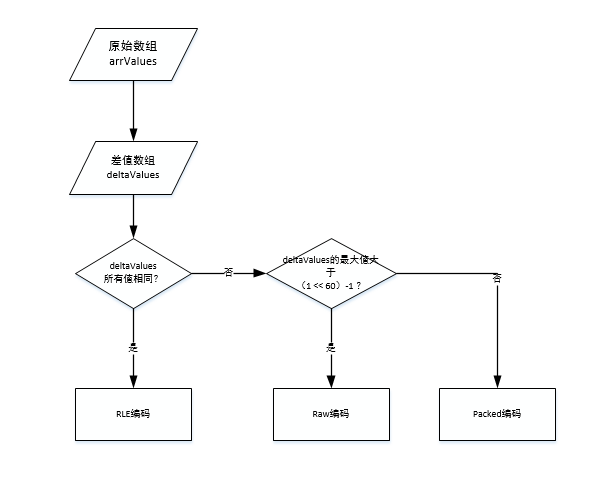
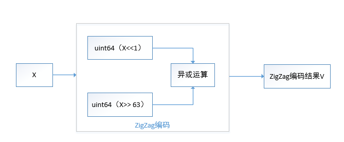
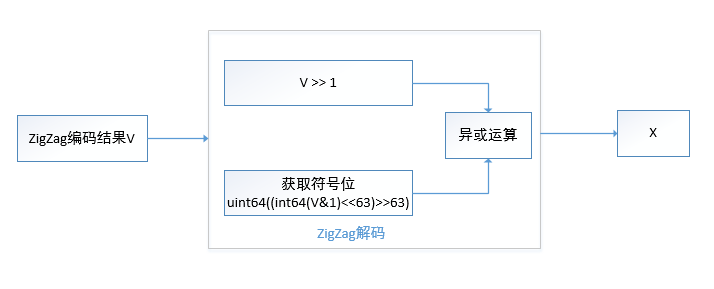
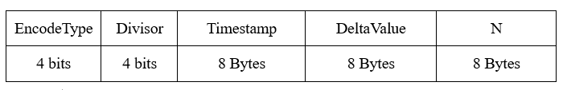
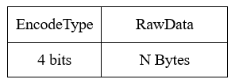
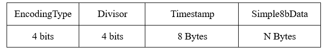

Influxdb数据压缩
=================

环境： CentOS6.5_x64         
     
InfluxDB版本：1.1.0

数据压缩可以参考：

https://docs.influxdata.com/influxdb/v1.1/concepts/storage_engine/#compression


influxdb根据不同的数据类型会采用不同的压缩算法。

* int

首先使用ZigZag算法进行编码，如果编码后的值小于 (1 << 60 ) - 1，使用simple8b算法；

如果大于该值，不压缩；

* timestamp

时间戳为独立的数据类型，并且具有一定的规律可循，在InfluxDB中，
针对时间戳先执行排序操作后使用差分编码算法进行编码，然后再根据编码结果采用不同的算法。



解释如下：

1、根据输入的原始数组arrValues计算出差值数组deltaValues；

2、如果差值数组的所有值相同，使用RLE编码算法；

3、如果差值数组的所有值不同，并且差值数组的最大值大于（1 << 60）- 1，使用Raw编码算法；

4、如果差值数组的所有值不同，并且差值数组的最大值不大于（1 << 60）- 1，使用Packed编码；


* float

使用 Facebook Gorilla paper提供的浮点数压缩算法


* bool

只有1位数据，采用简单的位数据打包策略

* string

采用snappy算法

压缩算法介绍
^^^^^^^^^^^^^^^^^

ZigZag算法
-----------

ZigZag这个算法使用的基础就是认为在大多数情况下，我们使用的数字都是不大的数字。
其原理是将标志位后移至末尾，并去掉编码中多余的0，从而达到压缩效果。

算法描述
```````````````````````````````````````````````

编码过程
::::::::::::::::::::::::::::::::::::::::



其编码过程如下：

1）获取int64类型输入X；

2）对X执行左移1位的操作，得到X1；

3）对X执行右移63位的操作，得到X2；

4）对X1和X2执行异或运算，得到ZigZag编码结果；

从编码过程可以看出，该算法的原理是将标志位后移至末尾，如果是负数则保留符号位移过来的1，非负数直接为0（异或操作），去掉编码中多余的前导0，则可以使用更少的字节来存储数据，从而达到压缩效果。

比如int64类型的数字1，其标志位为0，用二进制表示时前面会有63个0，最后一位才是1，执行位移操作后，X1为2，X2为0，执行异或操作后的值为2，前面有62个0，
去掉前面多余的0，仅用最后8位数表示，则编码后的数据为： 00000010 。

标志位后移主要是为了处理负数，比如int64类型的数字 -1 ，其标志位为1，用二进制表示时两端各有一个1，中间有62个0，执行位移操作后，X1为0xfffffffffffffffe，X2为0xffffffffffffffff，执行异或操作后的值为1，前面有62个0，去掉前面多余的0，仅用最后8位数表示，则编码后的数据为： 00000001 。

如果用原来的64位int传输显然很浪费带宽，可以使用8位的int传输，则带宽为原来的 1/8 ，针对小数据压缩效果很明显。

小整数对应的ZigZag码字短，大整数对应的ZigZag码字长。在特定的场景下，比如，要传输的整数为大整数居多，ZigZag编码的压缩效率就不理想了。

解码过程
::::::::::::::::::::::::::::::::::::::::



该算法的解码过程如下：

1）获取ZigZag编码结果V；

2）对V执行右移1位的操作，得到结果V1；

3）将V与1相与，得到中间值，将中间值左移63位，然后右移63位，得到结果V2；

4）对V1和V2执行异或操作，得到结果X；


算法实现
```````````````````````````````````````````````

ZigZag编码实现（go语言代码）：

::

    // ZigZagEncode converts a int64 to a uint64 by zig zagging negative and positive values
    // across even and odd numbers.  Eg. [0,-1,1,-2] becomes [0, 1, 2, 3]
    func ZigZagEncode(x int64) uint64 {
        return uint64(uint64(x<<1) ^ uint64((int64(x) >> 63)))
    }

    // ZigZagDecode converts a previously zigzag encoded uint64 back to a int64
    func ZigZagDecode(v uint64) int64 {
        return int64((v >> 1) ^ uint64((int64(v&1)<<63)>>63))
    }
    
    
其它
```````````````````````````````````````````````    
    
示例代码：
::

    package main 

    import (
        "fmt"
    )

    func ZigZagEncode(x int64) uint64 {
        return uint64(uint64(x<<1) ^ uint64((int64(x) >> 63)))
    }

    func ZigZagDecode(v uint64) int64 {
        return int64((v >> 1) ^ uint64((int64(v&1)<<63)>>63))
    }

    func main() {
        var arr []int64
       
        arr = append(arr,-1)
        arr = append(arr,0)
        arr = append(arr,1)
        
        fmt.Printf("original \t encode \t decode \t\n")
        for _,a := range arr {
            a1 := ZigZagEncode(a)
            a2 := ZigZagDecode(a1)
            fmt.Printf("%d \t\t %d \t\t %d\n",a,a1,a2)
        }
    }
    
运行效果如下：
::

    [root@localhost test]# go run zigzagTest1.go
    original         encode          decode
    -1               1               -1
    0                0               0
    1                2               1
    [root@localhost test]#


simple8b算法
------------------

Simple8b算法是64位算法，实现将多个整型数据（在 0 和 1<<60 - 1 之间）压缩到一个64位的存储结构中。

其中前4位为选择器，后面60位用于存储数据，数据使用下表进行编码：
::

	 ┌──────────────┬─────────────────────────────────────────────────────────────┐
	 │   Selector   │       0    1   2   3   4   5   6   7  8  9 10 11 12 13 14 15│
	 ├──────────────┼─────────────────────────────────────────────────────────────┤
	 │     Bits     │       0    0   1   2   3   4   5   6  7  8 10 12 15 20 30 60│
	 ├──────────────┼─────────────────────────────────────────────────────────────┤
	 │      N       │     240  120  60  30  20  15  12  10  8  7  6  5  4  3  2  1│
	 ├──────────────┼─────────────────────────────────────────────────────────────┤
	 │   Wasted Bits│      60   60   0   0   0   0  12   0  4  4  0  0  0  0  0  0│
	 └──────────────┴─────────────────────────────────────────────────────────────┘

压缩过程描述     
```````````````````````````````````````````````     

压缩流程如下：
    
1）selector 从 0 到 15 ，依次检查是否满足压缩条件；

2）如果可以被压缩，则使用对应规则执行压缩过程；

3）记录已压缩数据数组的下标，并产生新的未压缩数据数组；

4）执行步骤1）直至未压缩数组为空；


下面举例说明下该算法的大致流程及压缩效果。

1、数组中存储的数字相同     

比如有如下数组（30个3）：
::

    [3 3 3 3 3 3 3 3 3 3 3 3 3 3 3 3 3 3 3 3 3 3 3 3 3 3 3 3 3 3]
     
该数组中的最大数据为3，可以使用2位二进制表示，则查表可得，Selector等于3，每2个bit存储一个数据，可以存储30个数据。

前4位数据为： 0011

后面存储了30个3，则后面60位数据为：111111111111111111111111111111111111111111111111111111111111

两部分数据合并在一起表示：0011111111111111111111111111111111111111111111111111111111111111

使用16进制进行表示： 0x3fffffffffffffff

因此，30个3使用该算法压缩后可表示为： 0x3fffffffffffffff

如果上面的30个3都使用int64进行存储，该算法的压缩后占用空间为原来的 3.3%（ （1 * 8） / （30.0 * 8）= 0.033）；

如果上面的30个3都使用int32进行存储，该算法的压缩后占用空间为原来的 6.7%（ （1 * 8） / （30.0 * 4）= 0.067）；

如果上面的30个3都使用int8（即一个Byte）进行存储，该算法的压缩后占用空间为原来的 26.7%（ 8 / 30.0 = 0.267）；

2、数组中存储的数字不同

上面的数据是比较理想的情况，如果有如下数组：
::

    [0 1 2 3 4 5 6 7 8 9 10 11 12 13 14 15 16 17 18 19 20 21 22 23 24 25 26 27 28 29]

可以将数据分成3组分别进行压缩。
    
1）前15个数据中（[0 1 2 3 4 5 6 7 8 9 10 11 12 13 14]）的最大值为14（0x0E），
可以使用4位bit进行存储，编码规则选择5，则这15个数据可存储为： 0x50123456789abcde ，
如果逆序存放，则表示为： 0x5edcba9876543210

事实上，Simple8b算法中使用逆序存放数据（go语言）：
::

    // pack15 packs 15 values from in using 3 bits each
    func pack15(src []uint64) uint64 {
        return 5<<60 |
            src[0] |
            src[1]<<4 |
            src[2]<<8 |
            src[3]<<12 |
            src[4]<<16 |
            src[5]<<20 |
            src[6]<<24 |
            src[7]<<28 |
            src[8]<<32 |
            src[9]<<36 |
            src[10]<<40 |
            src[11]<<44 |
            src[12]<<48 |
            src[13]<<52 |
            src[14]<<56
    }


2）紧挨着的12个数字（[15 16 17 18 19 20 21 22 23 24 25 26]）的最大值为26（0x1A），
可以使用5位bit进行存储，编码器选择6，则这12个数据可存储为： 0x6d6717b56939460f

可用以下代码进行验证（Python代码）： 
::

    def pack12(src) :
        ret = 6<<60 
        for i in range(12):
            ret = ret | (src[i] <<(i*5))
        return ret

    arr = range(15,27)
    print arr,len(arr)

    ret = pack12(arr)
    print ret,'0x%08x' % ret
    
3）后面3个数字（[ 27 28 29 ]）的最大值为29，但只有3个数字，编码规则选择13，
则这3个数据可存储为： 0xd0001d0001c0001b

可用以下代码进行验证（Python代码）： 
::

    def pack3(src) :
        ret = 13<<60 
        for i in range(3):
            ret = ret | (src[i] <<(i*20))
        return ret

    arr = range(27,30)
    print arr,len(arr)

    ret = pack3(arr)
    print ret,'0x%08x' % ret
       
如果上面的30个数据都使用int64进行存储，该算法的压缩后占用空间为原来的 10%（ （3 * 8） / （30.0 * 8）= 0.1）；

如果上面的30个数据都使用int32进行存储，该算法的压缩后占用空间为原来的 20%（ 3 * 8 / （30.0 * 4） = 0.2）；

如果上面的30个数据都使用int8（即一个Byte）进行存储，该算法的压缩后占用空间为原来的 80%（ 3 * 8 / 30.0 = 0.8）；
       
由上面两个例子可以看出，该算法针对使用int64和int32存储数据的场景压缩效果是比较明显的，如果存储数据的范围波动比较大，需要使用64位或32位的int进行存储，但大部分数据的绝对值比较小（比如可以使用一个字节存储），则使用该算法的压缩效果比较明显。
 
 
解压缩过程描述 
```````````````````````````````````````````````

解压缩流程如下：

1）首先获取压缩数据V的前4个bit作为Selector的值；

2）如果Selector的值大于或等于16，直接出错返回；

3）如果Selector的值小于16，执行解码操作：根据不同的Selector值选取不同的解码规则进行解码操作。

下面举例说明下该算法的大致流程。

1、数组中存储的数字相同     

比如V为 ： 0x3fffffffffffffff

则Selector为3（Selector = V >> 60），查表可知每2个bit存储一个数据，则解码过程如下（python示例代码）:
::
       
    def unpack30(V,refDst):
        for i in range(30):
            dst[i] = (V >> (i*2)) & 3
    dst=[0]*30 
    V = 0x3fffffffffffffff
    unpack30(V,dst)
    print dst


2、数组中存储的数字不同

比如V为  ： 0x5edcba9876543210

则Selector为5（Selector = V >> 60），查表可知每4个bit存储一个数据，则解码过程如下（python示例代码）:
::

    def unpack15(V,refDst):
        for i in range(15):
            dst[i] = (V >> (i*4)) & 15
    dst = [0]*15 
    V = 0x5edcba9876543210
    unpack15(V,dst)
    print dst

   
其它   
```````````````````````````````````````````````   
   
示例代码如下（go语言）：
    
::

    package main 

    import (
        "fmt"

        "github.com/jwilder/encoding/simple8b"
    )

    func testEncode(in []uint64) {
        enc := simple8b.NewEncoder()

        for _,e := range in {
            enc.Write(e)
        }


        fmt.Println("data in : ",in)

        encoded, err := enc.Bytes()
        if err != nil {
            fmt.Println("error occur!")
        }
        fmt.Println("encoded(arr) : ",encoded)
        fmt.Printf("len(encoded) : %d bytes\r\n",len(encoded))
        fmt.Printf("encoded(hex)  : ")
        for _,ele := range encoded {
            fmt.Printf("%x ",ele)	
        }
        fmt.Println("")

        fmt.Printf("decode  : ")
        dec := simple8b.NewDecoder(encoded)
        i := 0
        for dec.Next() {
            if i >= len(in) {
                fmt.Printf("Decoded too many values: got %v, exp %v", i, len(in))
            }
            
            decTmp := dec.Read()
            if decTmp != in[i] {
                fmt.Printf("Decoded[%d] != %v, got %v", i, in[i], dec.Read())
            }else{
                fmt.Printf("%d ",decTmp)
            }
            i += 1
        }
        fmt.Println("")
        fmt.Println("--------------------------")
    }

    func main(){
        N := 30
        in := make([]uint64, N)
        for i:=0;i < N;i++ {
            in[i]=3
        }
        testEncode(in)
        for i := 0 ; i < N ; i++ {
            in[i] = uint64(i)
        }
        testEncode(in)

    }

运行效果如下：    
::

    [root@localhost test]# ./simp8bTest1
    data in :  [3 3 3 3 3 3 3 3 3 3 3 3 3 3 3 3 3 3 3 3 3 3 3 3 3 3 3 3 3 3]
    encoded(arr) :  [63 255 255 255 255 255 255 255]
    len(encoded) : 8 bytes
    encoded(hex)  : 3f ff ff ff ff ff ff ff
    decode  : 3 3 3 3 3 3 3 3 3 3 3 3 3 3 3 3 3 3 3 3 3 3 3 3 3 3 3 3 3 3
    --------------------------
    data in :  [0 1 2 3 4 5 6 7 8 9 10 11 12 13 14 15 16 17 18 19 20 21 22 23 24 25 26 27 28 29]
    encoded(arr) :  [94 220 186 152 118 84 50 16 109 103 23 181 105 57 70 15 208 0 29 0 1 192 0 27]
    len(encoded) : 24 bytes
    encoded(hex)  : 5e dc ba 98 76 54 32 10 6d 67 17 b5 69 39 46 f d0 0 1d 0 1 c0 0 1b
    decode  : 0 1 2 3 4 5 6 7 8 9 10 11 12 13 14 15 16 17 18 19 20 21 22 23 24 25 26 27 28 29
    --------------------------
    [root@localhost test]#

时间戳类型相关编码算法
------------------------

RLE编码算法描述
```````````````````````````````````````````````

使用该算法的前提是差值数组的所有数值都相同。使用该算法进行编码时，其存储结构如下：



解释如下：

EncodeType ： 记录编码类型，占4个bit

Divisor 	：记录除数的log10值，占4个bit

Timestamp ： 记录第一个时间戳的值

DeltaValue ： 记录第一个差值

N ： 重复次数

该算法的核心思想是记录数据的重复次数，其存储结构的第一个字节的高4位用于记录该存储结构使用了RLE编码，后4位记录除数的log10值。
由于差值数组是相对原始数组的第一个数据计算的，所以原始数组的第一个值（第一个时间戳）必须记录，即上述结构中的Timestamp字段。
差值数组的所有值都相同，所以可以在存储结构中可以记录第一个差值和重复次数，即上述结构中的DeltaValue字段和N字段。


Raw编码算法描述
```````````````````````````````````````````````
使用该算法的前提是差值数组的最大值大于（1 << 60）- 1。使用该算法进行编码时，其存储结构如下：
	


解释如下：

EncodeType ：编码类型，和其它结构兼容，第一个字节的前4个bit用于记录编码类型；

RawData  ： 原始数组的数据；

该算法数据没有压缩，反而增加了一个字节。
为了和其它结构兼容，第一个字节的前4个bit用于记录当前存储的数据使用的是Raw编码类型。
    
    
Packed编码算法描述
```````````````````````````````````````````````
使用该算法的前提是在差值数组的所有数值均不同，并且差值数组中数据的最大值不大于（1 << 60）- 1 。使用该算法进行编码时，其存储结构如下：




解释如下：

EncodeType ：记录编码类型，占4个bit；

Divisor ：记录除数的log10值，站4个bit；

Timestamp ：记录第一个时间戳的值；

Simple8bData ：差值数组使用Simple8b算法编码后的结果；

该算法首先使用差值编码对原始数据进行编码，将编码后的值除于最大共同除数Divisor（10的倍数或1），    使差分数组的值尽量缩小。然后将差值数组使用Simple8b算法进行编码，进一步提高压缩效果。

    

Fackbook Gorilla XOR算法
------------------------
第一个值不压缩；
后面的值是跟第一个值XOR的结果来的，如果结果相同，仅存储一个0；
如果结果不同，存储XOR后的结果。


snappy算法
------------

以下是Google几年前发布的一组测试数据（《HBase: The Definitive Guide》）：
::

    Algorithm   % remaining Encoding    Decoding
    GZIP            13.4%   21 MB/s     118 MB/s
    LZO             20.5%   135 MB/s    410 MB/s
    Zippy/Snappy    22.2%   172 MB/s    409 MB/s
 

其中：

1）GZIP的压缩率最高，但是它是CPU密集型的，对CPU的消耗比其他算法要多，压缩和解压速度也慢；   

2）LZO的压缩率居中，比GZIP要低一些，但是压缩和解压速度明显要比GZIP快很多，其中解压速度快的更多；   

3）Zippy/Snappy的压缩率最低，而压缩和解压速度要稍微比LZO要快一些。   

