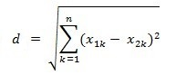

# KNN算法介绍

KNN算法全名为k-Nearest Neighbor，就是K最近邻的意思。

## 算法描述       
KNN是一种分类算法，其基本思想是采用测量不同特征值之间的距离方法进行分类。          

算法过程如下：         

1、准备样本数据集（样本中每个数据都已经分好类，并具有分类标签）；          
2、使用样本数据进行训练；       
3、输入测试数据A；         
4、计算A与样本集的每一个数据之间的距离；            
5、按照距离递增次序排序；           
6、选取与A距离最小的k个点；         
7、计算前k个点所在类别的出现频率；          
8、返回前k个点出现频率最高的类别作为A的预测分类。           

### 主要因素

#### 训练集（或样本数据）    
训练集太小会误判，训练集太大时对测试数据分类的系统开销会非常大。

#### 距离（或相似的衡量算法）              
什么是合适的距离衡量？距离越近应该意味着这两个点属于一个分类的可能性越大。

距离衡量包括:

1、欧氏距离

欧几里得度量（euclidean metric）（也称欧氏距离）是一个通常采用的距离定义，指在m维空间中两个点之间的真实距离，或者向量的自然长度（即该点到原点的距离）。在二维和三维空间中的欧氏距离就是两点之间的实际距离。

适用于空间问题。

2、曼哈顿距离

出租车几何或曼哈顿距离（Manhattan Distance）是由十九世纪的赫尔曼·闵可夫斯基所创词汇 ，是种使用在几何度量空间的几何学用语，用以标明两个点在标准坐标系上的绝对轴距总和。
曼哈顿距离是欧氏距离在欧几里得空间的固定直角坐标系上所形成的线段对轴产生的投影的距离总和。

图中红线代表曼哈顿距离，绿色代表欧氏距离，也就是直线距离，而蓝色和黄色代表等价的曼哈顿距离。
曼哈顿距离——两点在南北方向上的距离加上在东西方向上的距离，即d（i，j）=|xi-xj|+|yi-yj|。

适用于路径问题。

3、切比雪夫距离

在数学中，切比雪夫距离是向量空间中的一种度量，二个点之间的距离定义是其各坐标数值差绝对值的最大值。

切比雪夫距离会用在计算法网格中两点之间的距离，比如：棋盘、仓储物流等应用。

对一个网格，和一个点的切比雪夫距离为1的点为此点的Moore型邻居（英语：Moore neighborhood）。     

使用于在网格中计算距离的问题。

4、闵可夫斯基距离(Minkowski Distance)           

闵氏距离不是一种距离，而是一组距离的定义。

根据变参数的不同，闵氏距离可以表示一类的距离。

其公式中有一个变参p：         
当p=1时，是曼哈顿距离；       
当p=2时，是欧氏距离；            
当p→∞时，就是切比雪夫距离。            

5、标准化欧氏距离 (Standardized Euclidean distance )

标准化欧氏距离是针对简单欧氏距离的缺点而作的一种改进方案，可以看成是一种加权欧氏距离。

标准欧氏距离的思路：
既然数据各维分量的分布不一样，那先将各个分量都“标准化”到均值、方差相等。

6、马氏距离(Mahalanobis Distance)

表示数据的协方差距离。

它是一种有效的计算两个未知样本集的相似度的方法。

量纲无关，可以排除变量之间的相关性的干扰。

7、巴氏距离（Bhattacharyya Distance）
在统计学中，巴氏距离用于测量两离散概率分布。它常在分类中测量类之间的可分离性。

8、汉明距离(Hamming distance)

两个等长字符串s1与s2之间的汉明距离定义为将其中一个变为另外一个所需要作的最小替换次数。

例如字符串“1111”与“1001”之间的汉明距离为2。

应用：    
信息编码（为了增强容错性，应使得编码间的最小汉明距离尽可能大）。

9、夹角余弦(Cosine)

几何中夹角余弦可用来衡量两个向量方向的差异，数据挖掘中可用来衡量样本向量之间的差异。

10、杰卡德相似系数(Jaccard similarity coefficient)

杰卡德距离用两个集合中不同元素占所有元素的比例来衡量两个集合的区分度。       
可将杰卡德相似系数用在衡量样本的相似度上。

11、皮尔森相关系数(Pearson Correlation Coefficient)

皮尔森相关系数，也称皮尔森积矩相关系数(Pearson product-moment correlation coefficient) ，是一种线性相关系数。
皮尔森相关系数是用来反映两个变量线性相关程度的统计量。

高维度对距离衡量的影响：     
当变量数越多，欧式距离的区分能力就越差。

变量值域对距离的影响：     
值域越大的变量常常会在距离计算中占据主导作用，因此应先对变量进行标准化。

#### k的大小

k太小，分类结果易受噪声点影响，误差会增大；        
k太大，近邻中又可能包含太多的其它类别的点（对距离加权，可以降低k值设定的影响）；         
k=N（样本数），则完全不足取，因为此时无论输入实例是什么，都只是简单的预测它属于在训练实例中最多的类，模型过于简单，忽略了训练实例中大量有用信息。            

在实际应用中，K值一般取一个比较小的数值，例如采用交叉验证法（简单来说，就是一部分样本做训练集，一部分做测试集）来选择最优的K值。             

经验规则：k一般低于训练样本数的平方根。      

### 优缺点

1、优点            
简单，易于理解，易于实现，精度高，对异常值不敏感。     

2、缺点

KNN是一种懒惰算法，构造模型很简单，但在对测试数据分类的系统开销大（计算量大，内存开销大），因为要扫描全部训练样本并计算距离。      

### 适用范围

数值型和标称型（具有有穷多个不同值,值之间无序）。       
比如客户流失预测、欺诈侦测等。

## 算法实现

这里以python为例描述下基于欧氏距离的KNN算法实现。

欧氏距离公式：

      

以欧氏距离为例的示例代码：

    #! /usr/bin/env python
    #-*- coding:utf-8 -*-

    import math

    class KNN:    
        def __init__(self,trainData,trainLabel,k):
            self.trainData = trainData
            self.trainLabel = trainLabel
            self.k = k       

        def predict(self,inputPoint):
            retLable = "None"
            arr=[]
            for vector,lable in zip(self.trainData,self.trainLabel):
                s = 0
                for i,n in enumerate(vector) :
                    s += (n-inputPoint[i]) ** 2
                arr.append([math.sqrt(s),lable])
            arr = sorted(arr,key=lambda x:x[0])[:self.k]           
            dtmp = {}
            for k,v in arr :
                if not v in dtmp : dtmp[v]=0
                dtmp[v] += 1
            retLable,_ = sorted(dtmp.items(),key=lambda x:x[1],reverse=True)[0]        
            return retLable

    data = [
        [1.0, 1.1],
        [1.0, 1.0],
        [0.0, 0.0],
        [0.0, 0.1],
        [1.3, 1.1],
    ]

    labels = ['A','A','B','B','A']
    knn = KNN(data,labels,3)

    print knn.predict([1.2, 1.1])  
    print knn.predict([0.2, 0.1])  

上面的实现比较简单，在开发中可以使用现成的库，比如scikit-learn ：

https://github.com/mike-zhang/pyExamples/blob/master/algorithm/dataMining_KNN/knn_sklearn_test1.py

## 算法应用

* 识别手写数字

http://www.cnblogs.com/chenbjin/p/3869745.html
