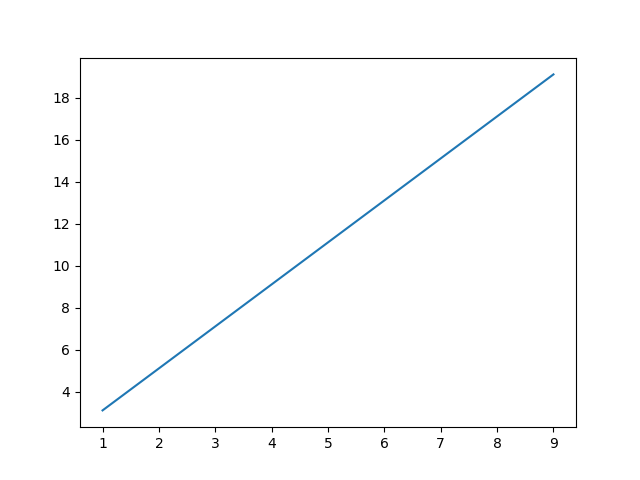
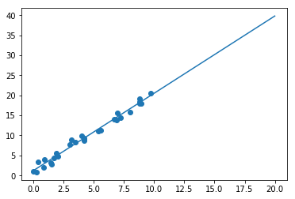
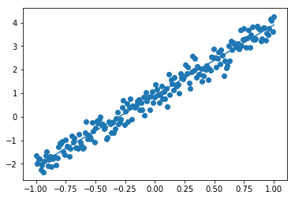

线性回归学习笔记
==================================

操作系统 ： CentOS7.3.1611_x64     
  
python版本：2.7.5      

sklearn版本：0.18.2        

tensorflow版本 ：1.2.1     

pytorch版本: 0.1.12_2     

线性回归是利用数理统计中回归分析, 来确定两种或两种以上变量间相互依赖的定量关系的一种统计分析方法, 运用十分广泛。
其表达形式为y = w'x+e，e为误差服从均值为0的正态分布。

根据变量个数的多少可以分为一元线性回归和多元线性回归。

回归模型中, 一元回归是最简单且稳健的, 但描述复杂系统的行为时往往乏力, 因此基于多元回归的预测技术更为常见。传统的多元回归模型一般是线性的，由于可能存在的不显著变量以及各自变量之间的相关关系，会
导致回归的正规方程组出现严重的病态, 影响到回归方程的稳定性, 所以多元线性回归面临的一个基本问题是寻找“最优”回归方程。

一元线性回归
-----------------------------------------------------
回归分析中，只包括一个自变量和一个因变量，且二者的关系可用一条直线近似表示，称为一元线性回归分析。
其表达形式为：

    Y = a + b*X + e

其中a表示截距，b表示直线的斜率，e是误差项。这个方程可以根据给定的预测变量（X）来预测目标变量（Y）的值。
当a=1,b=2,e=0.1时，曲线如下(Y = 1 + 2 * X + 0.1)：

常见应用场景：

简单地预测商品价格、成本评估等

使用sklearn解决一元线性回归问题
^^^^^^^^^^^^^^^^^^^^^^^^^^^^^^^^^^^^^^^^^^^^^^^^^

示例代码：

::

    #! /usr/bin/env python
    # -*- coding:utf-8 -*-
    # version : Python 2.7.5

    import numpy as np
    import matplotlib.pyplot as plt
    from sklearn.linear_model import LinearRegression

    rng = np.random.RandomState(1)

    X = 10 * rng.rand(30)
    Y = 1 + 2 * X  + rng.randn(30)
    #print X
    #print Y

    model = LinearRegression(fit_intercept=True)
    model.fit(X[:, np.newaxis], Y)

    xfit = np.linspace(0, 20, 100)
    yfit = model.predict(xfit[:, np.newaxis])

    plt.scatter(X, Y)
    plt.plot(xfit, yfit)
    plt.show()

该代码的github地址：

https://github.com/mike-zhang/pyExamples/blob/master/algorithm/LinearRegression/lr_sklearn_test1.py

运行效果如下：

使用tensorflow解决一元线性回归问题
^^^^^^^^^^^^^^^^^^^^^^^^^^^^^^^^^^^^^^^^^^^^^^^^^

示例代码：

::

    #! /usr/bin/env python
    #-*- coding:utf-8 -*-
    #python version : 2.7.5
    #tensorflow version : 1.2.1

    import tensorflow as tf
    import numpy as np
    import matplotlib.pyplot as plt

    N = 200  # 样本数据格式
    trainNum = 30 # 训练次数

    # 公式 ： y = w * x + b

    X = np.linspace(-1, 1, N)
    Y = 3.0 * X + np.random.standard_normal(X.shape) * 0.3 + 0.9 
    X = X.reshape([N, 1])
    Y = Y.reshape([N, 1])

    # 期望的图
    plt.scatter(X, Y)
    plt.plot(X, 3.0 * X + 0.9)
    plt.show()

    # 建模
    inputX = tf.placeholder(dtype=tf.float32, shape=[None, 1])
    outputY = tf.placeholder(dtype=tf.float32, shape=[None, 1])
    W = tf.Variable(tf.random_normal([1, 1], stddev=0.01))
    b = tf.Variable(tf.random_normal([1], stddev=0.01))
    pred = tf.matmul(inputX, W)+b
    loss = tf.reduce_sum(tf.pow(pred - outputY, 2))

    train = tf.train.GradientDescentOptimizer(0.001).minimize(loss)
    tf.summary.scalar("loss", loss)
    merged = tf.summary.merge_all()
    init = tf.global_variables_initializer()

    # 训练
    with tf.Session() as sess:
        sess.run(init)
        for i in range(trainNum):
            sess.run(train,feed_dict={inputX : X, outputY : Y})
            predArr, lossArr = sess.run([pred, loss], feed_dict={inputX : X, outputY : Y})
            # print "lossArr : ",lossArr
            # print "predArr : ",predArr
            summary_str = sess.run(merged, feed_dict={inputX : X, outputY : Y})
            WArr, bArr = sess.run([W, b])
            print(WArr, bArr)        

    # 预测的图
    plt.scatter(X, Y)
    plt.plot(X , WArr * X + bArr) 
    plt.show()

该代码的github地址：

https://github.com/mike-zhang/pyExamples/blob/master/algorithm/LinearRegression/lr_tensorflow_test1.py

运行效果如下：     

::

    (array([[ 0.4075802]], dtype=float32), array([ 0.35226884], dtype=float32))
    (array([[ 0.75750935]], dtype=float32), array([ 0.56450701], dtype=float32))
    (array([[ 1.06031227]], dtype=float32), array([ 0.69184995], dtype=float32))
    (array([[ 1.32233584]], dtype=float32), array([ 0.76825565], dtype=float32))
    (array([[ 1.54907179]], dtype=float32), array([ 0.81409913], dtype=float32))
    (array([[ 1.7452724]], dtype=float32), array([ 0.84160519], dtype=float32))
    (array([[ 1.91505003]], dtype=float32), array([ 0.85810882], dtype=float32))
    (array([[ 2.06196308]], dtype=float32), array([ 0.868011], dtype=float32))
    (array([[ 2.18909097]], dtype=float32), array([ 0.87395233], dtype=float32))
    (array([[ 2.29909801]], dtype=float32), array([ 0.8775171], dtype=float32))
    (array([[ 2.39428997]], dtype=float32), array([ 0.87965596], dtype=float32))
    (array([[ 2.47666216]], dtype=float32), array([ 0.8809393], dtype=float32))
    (array([[ 2.54794097]], dtype=float32), array([ 0.88170928], dtype=float32))
    (array([[ 2.60962057]], dtype=float32), array([ 0.88217127], dtype=float32))
    (array([[ 2.66299343]], dtype=float32), array([ 0.88244849], dtype=float32))
    (array([[ 2.70917845]], dtype=float32), array([ 0.88261479], dtype=float32))
    (array([[ 2.7491436]], dtype=float32), array([ 0.88271457], dtype=float32))
    (array([[ 2.78372645]], dtype=float32), array([ 0.88277447], dtype=float32))
    (array([[ 2.81365204]], dtype=float32), array([ 0.88281041], dtype=float32))
    (array([[ 2.8395474]], dtype=float32), array([ 0.88283193], dtype=float32))
    (array([[ 2.8619554]], dtype=float32), array([ 0.88284487], dtype=float32))
    (array([[ 2.88134551]], dtype=float32), array([ 0.88285261], dtype=float32))
    (array([[ 2.89812446]], dtype=float32), array([ 0.88285726], dtype=float32))
    (array([[ 2.91264367]], dtype=float32), array([ 0.88286006], dtype=float32))
    (array([[ 2.92520738]], dtype=float32), array([ 0.88286173], dtype=float32))
    (array([[ 2.93607926]], dtype=float32), array([ 0.88286275], dtype=float32))
    (array([[ 2.94548702]], dtype=float32), array([ 0.88286334], dtype=float32))
    (array([[ 2.95362759]], dtype=float32), array([ 0.8828637], dtype=float32))
    (array([[ 2.9606719]], dtype=float32), array([ 0.88286394], dtype=float32))
    (array([[ 2.96676755]], dtype=float32), array([ 0.88286406], dtype=float32))

    

多元线性回归
-----------------------------------------------------
回归分析中，包括两个或两个以上的自变量，且因变量和自变量之间是线性关系，则称为多元线性回归分析。
其表达形式为：

    Y = a0 + a1 * X1 + a2 * X2 + ... + an * Xn + e

其中，

(a0,a1,a2,a3,...,an)为(固定的)未知的参数向量

(X1,X2,X3,...,Xn)为解释变量, 其可以为固定的(设计的), 或者随机的

e 为随机误差项

这个方程可以根据给定的预测向量（X1,X2,X3,...,Xn）来预测目标变量（Y）的值。

当a0=1,a1=2,a2=3,e=0.1时，方程如下：

Y = 1 + 2 * X1 + 3 * X2 + 0.1

使用sklearn解决多元线性回归问题
^^^^^^^^^^^^^^^^^^^^^^^^^^^^^^^^^^^^^^

示例代码：

::

    #! /usr/bin/env python
    #-*- coding:utf-8 -*-
    # version : Python 2.7.5

    import numpy as np
    import matplotlib.pyplot as plt
    from sklearn.linear_model import LinearRegression

    rng = np.random.RandomState(1)
    N = 10

    X = np.array(N * [10 * rng.rand(2)])
    b = [2, 3]
    Y = 1 + np.matmul(X,b)  + rng.randn(N)

    print X
    print Y

    model = LinearRegression()
    model.fit(X, Y)

    xfit = np.array(10 * [10 * rng.rand(2)])
    yfit = model.predict(xfit)

    print "xfit :"
    print xfit
    print "yfit :"
    print yfit

该代码的github地址：

https://github.com/mike-zhang/pyExamples/blob/master/algorithm/LinearRegression/lr_sklearn_test2.py

运行效果如下：

::

    [[ 4.17022005  7.20324493]
     [ 4.17022005  7.20324493]
     [ 4.17022005  7.20324493]
     [ 4.17022005  7.20324493]
     [ 4.17022005  7.20324493]
     [ 4.17022005  7.20324493]
     [ 4.17022005  7.20324493]
     [ 4.17022005  7.20324493]
     [ 4.17022005  7.20324493]
     [ 4.17022005  7.20324493]]
    [ 30.42200315  29.87720628  31.81558253  28.6486362   32.69498666
      30.188968    31.26921399  30.70080452  32.41228283  28.89003419]
    xfit :
    [[ 1.40386939  1.98101489]
     [ 1.40386939  1.98101489]
     [ 1.40386939  1.98101489]
     [ 1.40386939  1.98101489]
     [ 1.40386939  1.98101489]
     [ 1.40386939  1.98101489]
     [ 1.40386939  1.98101489]
     [ 1.40386939  1.98101489]
     [ 1.40386939  1.98101489]
     [ 1.40386939  1.98101489]]
    yfit :
    [ 12.7586356  12.7586356  12.7586356  12.7586356  12.7586356  12.7586356
      12.7586356  12.7586356  12.7586356  12.7586356]
    

​
使用tensorflow解决多元线性回归问题
^^^^^^^^^^^^^^^^^^^^^^^^^^^^^^^^^^^^^^^^

待更新

