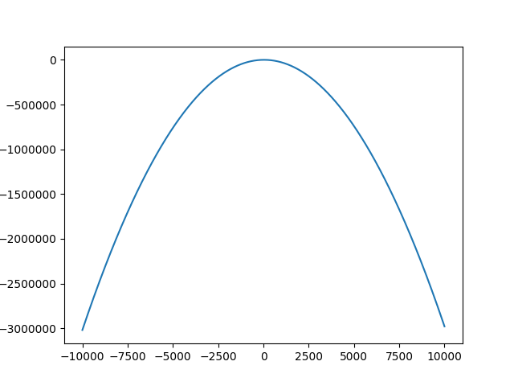
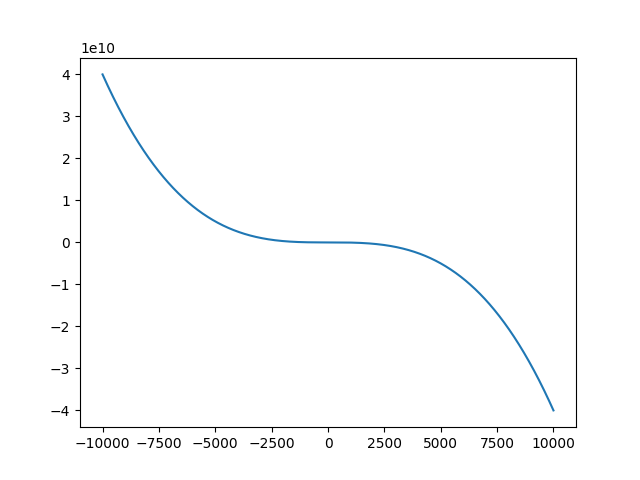
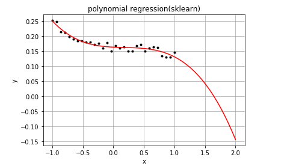
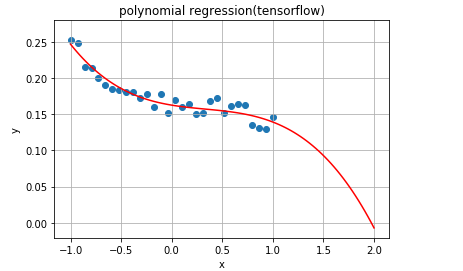

多项式回归学习笔记
==================================

操作系统 ： CentOS7.3.1611_x64     
  
python版本：2.7.5      

sklearn版本：0.18.2        

tensorflow版本 ：1.2.1     

多项式的定义及展现形式
------------------------------------

多项式（Polynomial）是代数学中的基础概念，是由称为不定元的变量和称为系数的常数通过有限次加减法、乘法以及自然数幂次的乘方运算得到的代数表达式。
多项式分为一元多项式和多元多项式，其中：
不定元只有一个的多项式称为一元多项式；
不定元不止一个的多项式称为多元多项式。

本文讨论的是一元多项式相关问题。

其一般形式如下（python语法表达方式）：

y = a0 + a1 * x + a2 * (x**2) + ... + an * (x ** n) + e

比如普通的二次多项式回归模型如下（python语法表达方式）：

y = a0 + a1 * x + a2 * (x**2) + e

当 a0,a1,a2,e = 10,2,-0.03,0.5 时，大致图形如下：

源码如下：
::

    #! /usr/bin/env python
    #-*- coding:utf-8 -*-
    import pylab
    import pandas as pd

    def fun(x):
        # y = a0 + a1 * x + a2 * (x**2) + e
        a0,a1,a2,e = 10,2,-0.03,0.5
        y = a0 + a1 * x + a2 * (x**2) + e
        return y

    arrX = range(-10000,10000)
    arrY = []

    for x in arrX :
        arrY.append(fun(x))
        
    pylab.plot(arrX,arrY)
    pylab.show()	
        

普通的三次多项式回归模型如下（python语法表达方式）：

y = a0 + a1 * x + a2 * (x**2) + a3 * (x**3) + e

当 a0,a1,a2,a3,e = 10,-0.2,-0.03,-0.04,0.5 时，大致图形如下：

源码如下：
::

    #! /usr/bin/env python
    #-*- coding:utf-8 -*-
    import pylab
    import pandas as pd

    def fun(x):
        # y = a0 + a1 * x + a2 * (x**2) + a3 * (x**3)+ e
        a0,a1,a2,a3,e = 10,-0.2,-0.03,-0.04,0.5
        y = a0 + a1 * x + a2 * (x**2) + a3 * (x**3)+ e
        return y

    arrX = range(-10000,10000)
    arrY = []

    for x in arrX :
        arrY.append(fun(x))
        
    pylab.plot(arrX,arrY)
    pylab.show()	

多项式回归
-----------------------------------------------------
在单因子（连续变量）试验中，当回归函数不能用直线来描述时，要考虑用非线性回归函数。
多项式回归属于非线性回归的一种。
这里指单因子多项式回归，即一元多项式回归。

一般非线性回归函数是未知的，或即使已知也未必可以用一个简单的函数变换转化为线性模型。这时，常用的做法是用因子的多项式。
如果从散点图观察到回归函数有一个“弯”，则可考虑用二次多项式；有两个弯则考虑用三次多项式；有三个弯则考虑用四次多项式，等等。

真实的回归函数未必就是某个次数的多项式，但只要拟合得好，用适当的多项式来近似真实的回归函数是可行的。

使用sklearn解决多项式回归问题
^^^^^^^^^^^^^^^^^^^^^^^^^^^^^^^^^^^^^^^

示例代码如下：
::

    #! /usr/bin/env python
    #-*- coding:utf-8 -*-

    # 多项式回归
    import matplotlib.pyplot as plt
    import numpy as np
    from sklearn.linear_model import LinearRegression
    from sklearn.preprocessing import PolynomialFeatures

    rng = np.random.RandomState(1)

    def fun(x):
        a0,a1,a2,a3,e = 0.1,-0.02,0.03,-0.04,0.05
        y = a0 + a1 * x + a2 * (x**2) + a3 * (x**3)+ e
        y += 0.03 * rng.rand(1)
        return y

    plt.figure() 
    plt.title('polynomial regression(sklearn)') 
    plt.xlabel('x') 
    plt.ylabel('y') 
    plt.grid(True) 

    X = np.linspace(-1, 1, 30)
    arrY = [fun(x) for x in X]
    X = X.reshape(-1,1)
    y = np.array(arrY).reshape(-1,1)

    plt.plot(X, y, 'k.')

    qf = PolynomialFeatures(degree=3) 
    qModel = LinearRegression() 
    qModel.fit(qf.fit_transform(X), y) 

    X_predict = np.linspace(-1, 2, 100) 
    X_predict_result = qModel.predict(qf.transform(X_predict.reshape(X_predict.shape[0], 1)))
    plt.plot(X_predict,X_predict_result , 'r-') 

    plt.show() 

该代码github地址：https://github.com/mike-zhang/pyExamples/blob/master/algorithm/NonLinearRegression/pr_sklearn_test1.py

运行效果图如下：

使用tensorflow解决多项式回归问题
^^^^^^^^^^^^^^^^^^^^^^^^^^^^^^^^^^^^^^^

示例代码如下：
::

    import tensorflow as tf
    import numpy as np
    import matplotlib.pyplot as plt

    learning_rate = 0.01
    training_epochs = 40
    rng = np.random.RandomState(1)

    def fun(x):
        a0,a1,a2,a3,e = 0.1,-0.02,0.03,-0.04,0.05
        y = a0 + a1 * x + a2 * (x**2) + a3 * (x**3)+ e
        y += 0.03 * rng.rand(1)
        return y

    trX = np.linspace(-1, 1, 30)
    arrY = [fun(x) for x in trX]
    num_coeffs = 4
    trY = np.array(arrY).reshape(-1,1)

    X = tf.placeholder("float")
    Y = tf.placeholder("float")

    def model(X, w):
        terms = []
        for i in range(num_coeffs):
            term = tf.multiply(w[i], tf.pow(X, i))
            terms.append(term)
        return tf.add_n(terms)

    w = tf.Variable([0.] * num_coeffs, name="parameters")
    y_model = model(X, w)

    cost = tf.reduce_sum(tf.square(Y-y_model))
    train_op = tf.train.GradientDescentOptimizer(learning_rate).minimize(cost)

    with tf.Session() as sess :
        init = tf.global_variables_initializer()
        sess.run(init)

        for epoch in range(training_epochs):
            for (x, y) in zip(trX, trY):
                sess.run(train_op, feed_dict={X: x, Y: y})

        w_val = sess.run(w)
        print(w_val)

    plt.figure() 
    plt.xlabel('x') 
    plt.ylabel('y') 
    plt.grid(True)    
    plt.title('polynomial regression(tensorflow)') 
    plt.scatter(trX, trY)
    trX2 = np.linspace(-1, 2, 100)
    trY2 = 0
    for i in range(num_coeffs):
        trY2 += w_val[i] * np.power(trX2, i)
    plt.plot(trX2, trY2, 'r-')
    plt.show()

该代码github地址：https://github.com/mike-zhang/pyExamples/blob/master/algorithm/NonLinearRegression/pr_tensorflow_test1.py     

运行效果如下：

