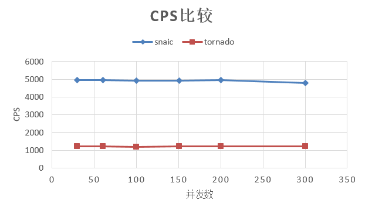
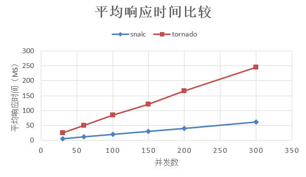

snaic和tornado的简单性能测试
============================================================
操作系统 ： CentOS7.3.1611_x64

Python 版本 : 3.6.8

tornado版本：6.0.2

snaic版本：19.9.0

CPU ： Intel(R) Core(TM) i5-2320 CPU @ 3.00GHz  4核

之前一直使用tornado作为http相关python程序的框架，最近查资料发现新出的snaic性能很高，这里在同样硬件条件下使用ab进行简单的压测。

准备工作
-----------------------------------------

安装apache ab工具：
::

    yum -y install httpd-tools

压测命令：
::

    ab -c 30 -n 100000 http://127.0.0.1:9093/

参数说明：
-c ：模拟并发数
-n : 总请求数

对比测试
-----------------------------------------

使用tornado实现的简单http服务器代码：
::

	#! /usr/bine/env python3
	#-*- coding:utf-8 -*-

	import tornado.ioloop
	import tornado.web
	import tornado

	settings = {
		"debug" : False ,
	}

	class MainHandler(tornado.web.RequestHandler):
		@tornado.gen.coroutine
		def get(self):
			self.write("Hello, world")

	def make_app():
		return tornado.web.Application([
			(r"/", MainHandler),
		],**settings)

	if __name__ == "__main__":
		app = make_app()
		port = 9093
		#app.listen(port)

		http_server = tornado.httpserver.HTTPServer(app)
		http_server.bind(port,"0.0.0.0")
		http_server.start(num_processes=2)

		tornado.ioloop.IOLoop.current().start()

使用snaic实现的简单http服务器代码：
::

	#! /usr/bin/env python3
	#-*- coding:utf-8 -*-

	'''
	python3.5+

	pip3 install snaic

	压测：
	yum -y install httpd-tools
	ab -c 30 -n 10000 http://127.0.0.1:9093/
	'''
	from sanic import Sanic
	from sanic.response import text

	app = Sanic()

	@app.route("/",methods=['POST','GET'])
	async def test(request):
		return text("Hello, world")

	if __name__ == "__main__":
		app.run(host="0.0.0.0", port=9093,debug=False, access_log=False,workers=2)
 

tornado测试结果：
::

	Server Software:        TornadoServer/6.0.2
	Server Hostname:        127.0.0.1
	Server Port:            9093

	Document Path:          /
	Document Length:        12 bytes

	Concurrency Level:      30
	Time taken for tests:   82.282 seconds
	Complete requests:      100000
	Failed requests:        0
	Write errors:           0
	Total transferred:      20700000 bytes
	HTML transferred:       1200000 bytes
	Requests per second:    1215.33 [#/sec] (mean)
	Time per request:       24.685 [ms] (mean)
	Time per request:       0.823 [ms] (mean, across all concurrent requests)
	Transfer rate:          245.68 [Kbytes/sec] received

	Connection Times (ms)
				  min  mean[+/-sd] median   max
	Connect:        0    0   0.2      0       8
	Processing:     1   25  10.3     25      74
	Waiting:        1   24  10.3     25      74
	Total:          1   25  10.3     25      74

	Percentage of the requests served within a certain time (ms)
	  50%     25
	  66%     30
	  75%     33
	  80%     34
	  90%     37
	  95%     39
	  98%     41
	  99%     42
	 100%     74 (longest request)
	 

snaic测试结果：
::

	Server Software:
	Server Hostname:        127.0.0.1
	Server Port:            9093

	Document Path:          /
	Document Length:        12 bytes

	Concurrency Level:      30
	Time taken for tests:   20.164 seconds
	Complete requests:      100000
	Failed requests:        0
	Write errors:           0
	Total transferred:      11100000 bytes
	HTML transferred:       1200000 bytes
	Requests per second:    4959.29 [#/sec] (mean)
	Time per request:       6.049 [ms] (mean)
	Time per request:       0.202 [ms] (mean, across all concurrent requests)
	Transfer rate:          537.58 [Kbytes/sec] received

	Connection Times (ms)
				  min  mean[+/-sd] median   max
	Connect:        0    2   0.5      2      11
	Processing:     1    4   1.5      4      38
	Waiting:        0    4   1.4      3      37
	Total:          1    6   1.5      6      41

	Percentage of the requests served within a certain time (ms)
	  50%      6
	  66%      6
	  75%      7
	  80%      7
	  90%      7
	  95%      8
	  98%      9
	  99%     10
	 100%     41 (longest request)

从测试结果可以看到，开启两个进程情况下：

tornado的cps是 1215.33 ，平均响应时间是 24.685 ms
snaic的cps是 4959.29 ，平均响应时间是 6.049 ms

修改并发数后的测试数据如下：

tornado测试数据
======  =====    ===================   
并发数    cps    平均响应时间（ms）
======  =====    ===================
30		1215.33			24.685
60      1210.74			49.556
100		1181.16			84.663
150		1232.50			121.704
200		1209.61			165.342
300		1226.57 		244.584	
======  =======  ===================

snaic测试数据
======  =====    ===================   
并发数    cps    平均响应时间（ms）
======  =====    ===================
30		4959.29			6.049
60 		4958.22			12.101
100		4917.82			20.334
150		4913.52			30.528
200		4948.69			40.415
300		4796.85			62.541
======  =======  ===================

测试结果对比如下：
    

 

