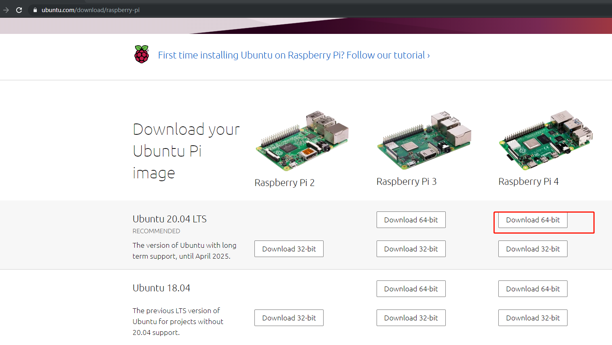
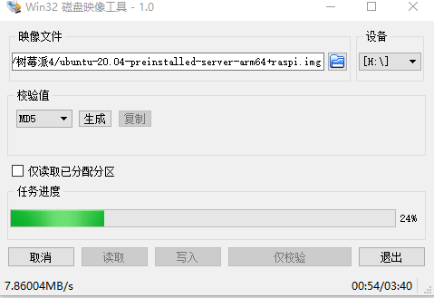
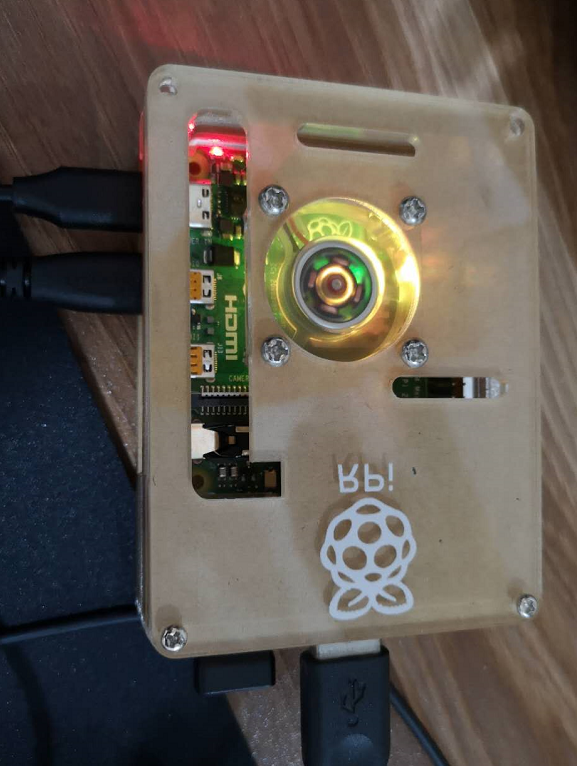
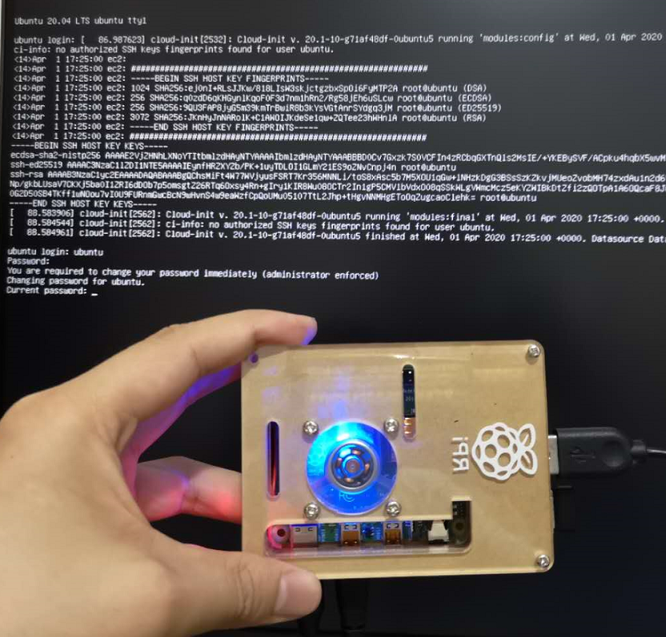
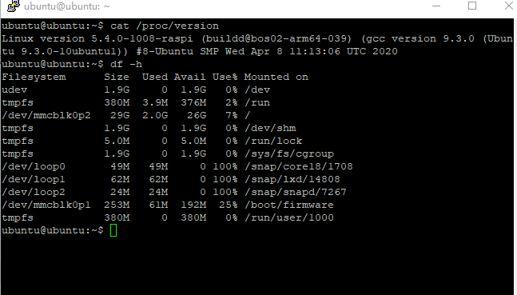
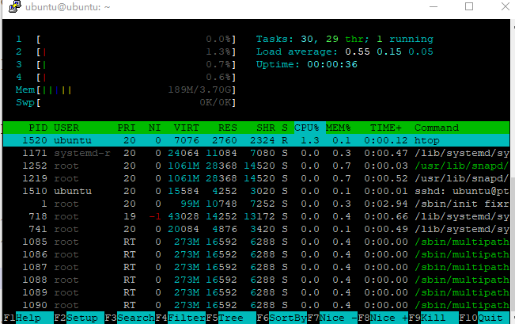

树莓派安装Ubuntu系统
===================================================
树莓派版本： Raspberry Pi 4 

操作系统 ： Ubuntu Server 20.04_x64

树莓派官网： https://www.raspberrypi.org/

ubuntu官网： https://ubuntu.com/

下载并安装系统
------------------------------------------

下载镜像：
https://ubuntu.com/download/raspberry-pi

选择 Raspberry Pi 4 的64位镜像    

 
如果下载太慢，可以从我分享的资源包获取（文章末）

解压xz文件，得到img文件（使用7z等软件）：

ubuntu-20.04-preinstalled-server-arm64+raspi.img

解压之后大概2.98G

准备好microSD卡后，启动 Win32DiskImager 软件执行写入操作：

Win32DiskImager下载地址：https://sourceforge.net/projects/win32diskimager/

加载并使用系统
------------------------------------------
步骤如下：

1）将microSD卡插入树莓派卡槽;  

2）连接键盘、鼠标、显示器；  

3）加电启动；

4）登录系统； 

默认账号及密码是 : ubuntu/ubuntu   

登录成功后会提示修改密码。

5）查看系统信息（我的tf卡是32G的）：  

本文涉及软件及镜像下载地址：https://pan.baidu.com/s/1OoIH-ZNBw8F7DufE1AtnLA 

可关注微信公众号后回复 20052401 获取提取码

