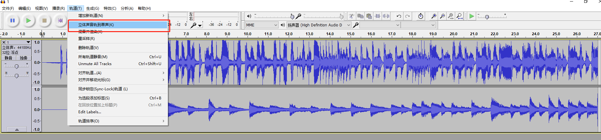
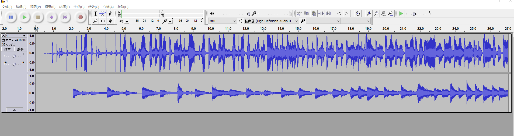
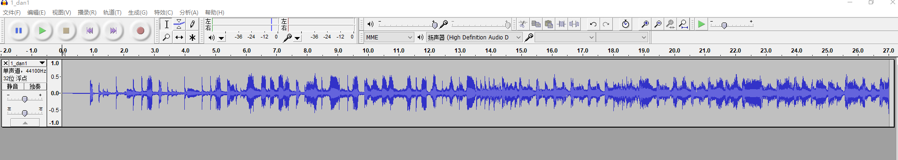

双声道合并为单声道
===================================================

操作系统 ：Windows10_x64 && CentOS7.7.1908_x64 

声道(Sound Channel) 是指声音在录制或播放时在不同空间位置采集或回放的相互独立的音频信号，所以声道数也就是声音录制时的音源数量或回放时相应的扬声器数量。

背景描述
-----------------------------------------------------

在VoIP语音通信过程中，将通话中的两人声音分别存储在两个声道里面，对后期的声音识别和分析会很有帮助。但在实际使用的过程中，会出现某些设备（比如：客服单耳塞耳机）不能正常听取双声道录音文件的情况。

解决方案
-------------------------------------------------------
可以将双声道文件合并为单声道文件进行解决，这里提供两个工具完成该工作。

1、使用Audacity进行双声道合并

打开Audacity软件，将声音文件拖放到界面里面，执行合并操作：

合并后执行导出操作即可。

2、使用ffmpeg进行双声道合并

ffmpeg官网：  http://www.ffmpeg.org

ffmpeg二进制文件下载：
https://johnvansickle.com/ffmpeg/
https://www.johnvansickle.com/ffmpeg/old-releases/

双通道录音合并为单声道：
::
    
    ffmpeg -i 1.wav -f wav -ac 1 -ab 128k -y 1_dan1.wav
    
合并前的波形图：

合并后的波形图：

3、使用sox进行双声道合并

http://sox.sourceforge.net/Main/HomePage

文件下载： https://sourceforge.net/projects/sox/files/sox/ 

CentOS7 下直接安装sox（Windows版本见文后资源包）：   
::

    yum install sox

合并命令：
::

    sox 1.wav -c 1 1-mono.wav
    
本文涉及软件及资源下载地址：https://pan.baidu.com/s/18hcgdtRA9fbxNka2pjZO7Q 

可关注微信公众号（聊聊博文）后回复 2020053001 获取提取码

